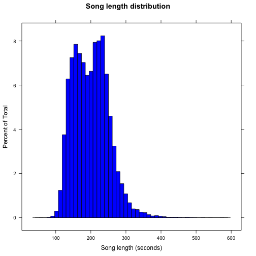
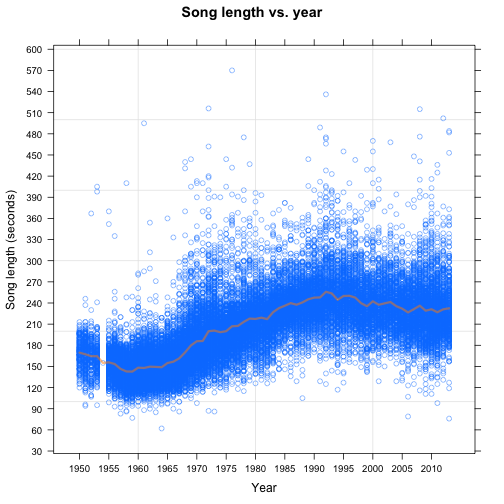
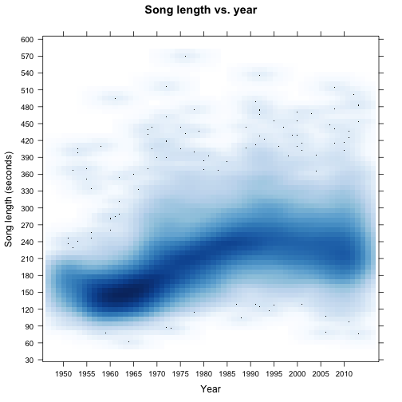
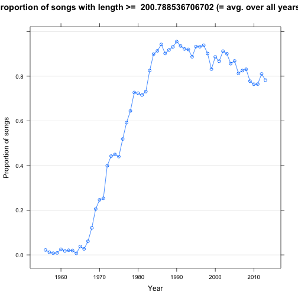
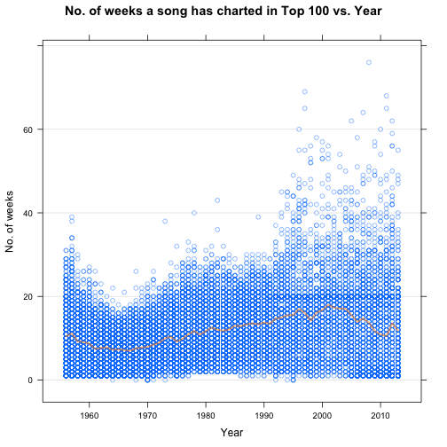
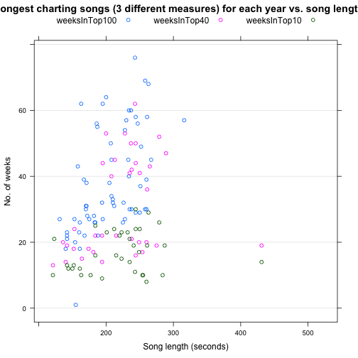
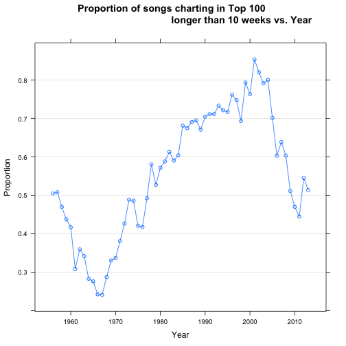

A Data Analysis and Visualization of Music Chart History
========================================================
*STAT 545A - Homework 6*  
*Christian Birch Okkels*  
*October 21, 2013*

Introduction
--------------------------------------------------------
Here, we perform a data analysis and visualization of the music chart history. The dataset to be investigated comes from the so-called *Whitburn Project* - a huge undertaking by music enthusiasts to preserve and share high-quality recordings of popular songs since the 1890s. The project has spawned a vast spreadsheet with data about almost 40,000 songs (as of 2013) that have been hits on the Billboard Chart since 1890. The dataset contains more than a hundred columns of raw data, with everything from song lengths, artists, songwriters, albums, labels, peak positions, number of weeks on the charts, and even week-by-week chart position, and so much more. This presents a ton of different options for data analysis and visualization; thus, with the relatively small time allotted for this assignment, we will probably just scratch the surface of the true range of possibilities.
Although various versions of the dataset exist, none of them are easy to come by. However, we have been lucky to dig one up from the mound of information that is the Internet. Of course, the dataset does come with plenty of shortcomings related to missing data for certain variables. As a result, it needs cleaning and preparation before we can go toe-to-toe with the fun stuff. This cleaning procedure will be described more thoroughly later. For now, let us have a look at some of what the dataset has to offer.

Description of Dataset
--------------------------------------------------------
As mentioned above, the dataset contains countless columns of raw data for each of the many observations. Some of the more interesting columns (for our case) are described in the table below. As some of the original variable names can be difficult to decipher, the variable names below are those specified in the cleaned version of the data. 

Variable name | Description
------------- | -------------
Year          | Year in which the single first hit its highest weekly position.
Yearly.Rank   | Yearly rankings. Formula: Highest position / Number of weeks at highest / Number of   weeks in Top 10/40/100.
Prefix        | Year and Rank combined for sorting purposes.
nWeeksChart   | Number of weeks the single charted.
nWeeksChartTop40  | Number of weeks the single charted at 40 or below.
nWeeksChartTop10  | Number of weeks the single charted at 10 or below.
nWeeksChartPeak   | Number of weeks the single charted at its highest position.
High          | The peak position of the single.
Artist        | The artist.
Artist.Inverted   | The artist (Last name, First name).
Featured      | Featured artist(s).
UnFeatured    | Additional artists not listed as featured.
Album         | Title of the album that the single originally came from.
Track         | Title of the song.
Time          | Length of the song.
Artist.ID     | A number ID to distinguish artists.
Label.Number  | Name of the label.
Genre         | Type of music.
Written.By    | The writers of the song.
ScorePoints   | Scoring system where points are given for every week on the charts, and by how high it charted each week; 100 points for no. 1, 99 for no. 2, etc.
Data.Entered  | The month/day/year the song first hit the charts.
Date.Peaked   | The month/day/year the song first hit its highest peak position.
X1st.Week - X66th.Week  | Chart ranking history: "1st Week" is the ranking of the song upon entering the chart; "2nd Week" is the ranking position of the song in the second week (if it's still on the chart); etc.


Data Cleaning and Preparation
--------------------------------------------------------
A separate R script, `data_cleanPrepare.R` has been coded to perform the initial data cleaning and preparation.

First, the script loads some necessary R packages: `lattice`, `plyr`, and `xtable`:

```r
library(lattice)
library(plyr)
library(xtable)
```

It then proceeds to load, or source, two functions from separate scripts:

```r
source("func_timeToSec.R")
source("func_htmlPrint.R")
```

The first script, `func_timeToSec.R`, contains a function that converts time formats of "hh:mm:ss" into seconds. This conversion is critical, since we need numeric or integer values to compute certain statistical properties, etc.
The second script, `func_htmlPrint.R`, holds a function to print data.frames as HTML tables.  
Now, the data cleaning script then loads the raw data from the text file `charts.txt`:

```r
charts_orig = read.delim("charts.txt")
# str(charts_orig) # basic sanity check.
```

The second line performs a basic sanity check. It has been out-commented since the output is very space-consuming.  
Next, we start to cut to the bone by keeping only the most interesting columns:

```r
charts <- subset(charts_orig, select = c(Year, Yearly.Rank, Prefix, CH, X40, 
    X10, PK, High, Artist, Featured, Album, Track, Time, Genre, Temp.1, Date.Entered, 
    Date.Peaked))
```

All of the many other columns are thereby excluded in the new data.frame `charts`. Now, as seen in the code above, some variables have rather odd names; e.g. `CH`, `X40`, etc. We therefore rename them to something more meaningful:

```r
charts <- rename(charts, c(CH = "nWeeksChart", X40 = "nWeeksChartTop40", X10 = "nWeeksChartTop10", 
    PK = "nWeeksChartPeak", Temp.1 = "ScorePoints"))
```

Many observations are missing data for certain variables. This is particularly so for older songs from the 1940s and earlier. Therefore, we keep only the data for the years 1950-2013:

```r
charts <- subset(charts, Year > 1949)
```

Now, the current column `Time` contains song lengths in the format "mm:ss". For many purposes, we would like to work with a more manageable format. We thus create a new column, `Time.num`, which contains the song length in seconds, and then add it to our data.frame. This is where we use the aforementioned function in the script `func_timeToSec.R`.

```r
charts$Time.num <- sapply(charts$Time, func_timeToSec)
```

As mentioned, some observations are missing data for certain variables--even after we cut away the older data. The main variable that we consider here is the new `Time.num`. Therefore, we find all blank entries and replace them with `NA`s, after which we eliminate all observations with `NA`:

```r
is.na(charts$Time) <- which(charts$Time == "")
charts <- subset(charts, !is.na(charts$Time))
```

The `nWeeksChart` column has also presented plenty of problems. It contains both blank elements and strange `n/a` (not even "NA"). Moreover, we would like it to be numeric. These cleaning procedures took a long time to figure out for this particular case, but we finally found the solution:

```r
# Remove all observations with blanks or 'n/a''s in nWeeksChart column.
charts <- subset(charts, !nWeeksChart == "")
charts <- subset(charts, !nWeeksChart == "n/a")
charts$nWeeksChart <- factor(charts$nWeeksChart)  # update factor levels.
# Convert nWeeksChart from Factor to Numeric:
charts$nWeeksChart <- as.numeric(levels(charts$nWeeksChart))[as.integer(charts$nWeeksChart)]
```

Finally, we write the cleaned data to the file `charts_clean.tsv`:

```r
write.table(charts, "charts_clean.tsv", quote = FALSE, sep = "\t", row.names = FALSE)
```


Data Aggregation and Plotting
--------------------------------------------------------
This part is the central one; here, we perform a variety of data aggregation and plotting tasks and write the data tables and figures to file.
The R script to perform all of this is `data_aggregatePlot.R`. It starts out by loading the necessary libraries and sourcing the two functions. Moreover, it reads the cleaned data saved by the script described above.

```r
charts <- read.delim("charts_clean.tsv")
str(charts)  # basic sanity check.
```

```
## 'data.frame':	28142 obs. of  18 variables:
##  $ Year            : int  2013 2013 2013 2013 2013 2013 2013 2013 2013 2013 ...
##  $ Yearly.Rank     : Factor w/ 890 levels "1","10","100",..: 127 206 230 244 271 295 314 330 339 352 ...
##  $ Prefix          : Factor w/ 28142 levels "1950_001","1950_002",..: 27812 27813 27814 27815 27816 27817 27818 27819 27820 27821 ...
##  $ nWeeksChart     : int  48 40 47 24 33 55 25 49 22 24 ...
##  $ nWeeksChartTop40: int  17 33 29 19 17 35 15 41 6 18 ...
##  $ nWeeksChartTop10: int  0 13 0 10 0 20 0 21 0 1 ...
##  $ nWeeksChartPeak : int  1 1 2 2 1 4 1 6 1 1 ...
##  $ High            : Factor w/ 103 levels "","--","0","1",..: 17 60 11 49 12 27 22 4 26 93 ...
##  $ Artist          : Factor w/ 7290 levels "'Til Tuesday",..: 5075 5357 3116 3761 2108 3116 6033 4397 4160 5148 ...
##  $ Featured        : Factor w/ 1856 levels ""," Feat. Master P, Destiny's Child, O'Dell, Mo B. Dick",..: 1 1 1 1088 1 1 1417 189 647 1 ...
##  $ Album           : Factor w/ 6668 levels "","#1's","#1s\311and Then Some",..: 3723 6656 1224 675 17 1224 6656 6656 6656 6116 ...
##  $ Track           : Factor w/ 22807 levels "#1","#1 Dee Jay",..: 11329 7476 10001 1905 18377 14935 6755 19766 13542 20213 ...
##  $ Time            : Factor w/ 357 levels "1:02","1:16",..: 185 128 158 146 177 106 121 154 141 166 ...
##  $ Genre           : Factor w/ 39 levels "","Adult Contemporary",..: 1 32 1 1 1 1 1 1 1 1 ...
##  $ ScorePoints     : Factor w/ 2686 levels "","#REF!","0",..: 1346 1688 1555 911 935 1855 475 1918 2681 810 ...
##  $ Date.Entered    : Factor w/ 3285 levels "02/20/2010","04/21/2012",..: 1755 2448 2322 2709 2637 2818 3268 3069 3141 513 ...
##  $ Date.Peaked     : Factor w/ 3284 levels "","1/1/00","1/1/05",..: 1155 91 162 232 27 2698 1232 1197 27 1155 ...
##  $ Time.num        : int  266 209 239 227 258 187 202 235 222 247 ...
```

The output above gives us a good overview of the cleaned, prepared data. For instance, we see the new `Time.num` column; it has integer elements which are exactly the song lengths in seconds (this can be confirmed by comparing the song lengths to those in the "mm:ss" format in the `Time` column). The `nWeeksChart` column, which was earlier a factor, has also successfully been converted; it was converted to numeric, but since it only contained integers, it is now saved as such.

In the following, we consider an array of different data aggregation and plotting tasks.

#### Distribution of Song Lengths
We start by the simple task of visualizing the distribution of song durations.

```r
histogram(~Time.num, charts, nint = 50, col = "blue", main = "Song length distribution", 
    xlab = "Song length (seconds)")
```

 

We see two peaks at roughly 150 and 225 seconds, corresponding to 2:30 and 3:45 minutes, respectively. It is interesting to see that the left dropoff is significantly steeper than the one on the right; apparently, for these more unusual song lengths, it is more common for songs to be longer.


#### Song Length vs. Year
In this part we consider how song lengths have evolved through time. This is done by making a scatterplot of duration against year. In order to avoid overplotting, we specify the `alpha` argument. Moreover, a line is drawn through the average song length for each year.

```r
startYear <- min(charts$Year) # starting year (used for plotting x-range).
endYear <- max(charts$Year)   # final year (used for plotting x-range).
songLengthVsYear_xyPlot <- xyplot(Time.num ~ Year, charts, 
       main = "Song length vs. year", xlab = "Year", ylab = "Song length (seconds)", grid = TRUE,
       alpha = 0.5, # combat overplotting via alpha.
       type = c("p", "a"), col.line = "darkorange", lwd = 3,  # draw averages.
       scales = list(y = list(at = seq(0, 600, 30)),
                     x = list(at = seq(startYear, endYear, 5))))
print(songLengthVsYear_xyPlot)
```

 

This shows something very interesting; having increased through the 1960s and up to the beginning of 1990s, the average song length peaked just before 1995 and has slowly decreased since then. (A similar plot can be made using `stripplot`, as exemplified in the data aggregation script.)  
Now, we can also combat overplotting via `smoothScatter` in the `panel` argument, as done below:

```r
songLengthVsYear_xyPlot2 <- xyplot(Time.num ~ Year, charts, main = "Song length vs. year", 
    xlab = "Year", ylab = "Song length (seconds)", grid = TRUE, scales = list(y = list(at = seq(0, 
        600, 30)), x = list(at = seq(startYear, endYear, 5))), panel = panel.smoothScatter)  # combat overplotting via smoothScatter.
print(songLengthVsYear_xyPlot2)
```

```
## KernSmooth 2.23 loaded Copyright M. P. Wand 1997-2009 (loaded the
## KernSmooth namespace)
```

 

This gives a nice view of where the majority of the data points are located. From the blue brush-like stroke, we see the same behaviour as described above.


#### Song Length vs. Decade
This part is much like the previous, except we consider decades instead of years. This is mainly used as an exercise to learn more about R. In this case, considering decades instead of years can lead to some very interesting possibilities; for example, it allows us to more easily condition on the decade variable as a factor (conditioning on the year variable would simply be too much, as there are too many levels), whereby we can obtain a lot of interesting plots.  
First, we use `cut()` to make a new factor called `Decade`. The factor levels are renamed directly in the function call. Then we use the decades in the plot:

```r
Decade <- cut(charts$Year, 6, labels = c("1950s", "1960s", "1970s", "1980s", 
    "1990s", "2000s"))
songLengthVsDecade_stripplot <- stripplot(Time.num ~ Decade, charts, grid = TRUE, 
    main = "Song length vs. decade", xlab = "Decade", ylab = "Song length (seconds)", 
    jitter.data = TRUE, panel = panel.smoothScatter, scales = list(y = list(at = seq(0, 
        600, 30), rot = c(0, 0), cex = 0.8), x = list(rot = c(0, 0), cex = 0.8)))
print(songLengthVsDecade_stripplot)
```

 

The same behaviour described above can also be hinted at here. Another interesting thing is the data for the 1960s; the big, blue, faded dot appears darker than those for the other decades. This means that there are more points gathered there. Consequently, it was more common in the 1960s for songs to be of roughly similar durations. Especially later on, in the past two decades, there seems to be a larger spread.


#### Shortest and Longest Songs Each Year
Let us find the shortest and longest songs for each year. We not only want just the minimum and maximum song lengths, but we would also like to see some info about these songs; e.g. song title, artist, etc. This data aggregation is performed via the `plyr` library. In the `ddply()` call we have custumized our own function:

```r
minSongLengthInfoEachYear <- ddply(charts, ~Year, function(x) {
    theMin <- which.min(x$Time.num)
    shortestSongInfo <- x[theMin, c("Year", "Track", "Artist", "Time.num", "Time")]
    shortestSongInfo <- rename(shortestSongInfo, c(Time.num = "TimeInSeconds"))
})
maxSongLengthInfoEachYear <- ddply(charts, ~Year, function(x) {
    theMax <- which.max(x$Time.num)
    longestSongInfo <- x[theMax, c("Year", "Track", "Artist", "Time.num", "Time")]
    longestSongInfo <- rename(longestSongInfo, c(Time.num = "TimeInSeconds"))
})
write.table(minSongLengthInfoEachYear, "table_minSongLengthInfoEachYear.txt", 
    quote = FALSE, sep = "\t", row.names = FALSE)  # write to file.
write.table(maxSongLengthInfoEachYear, "table_maxSongLengthInfoEachYear.txt", 
    quote = FALSE, sep = "\t", row.names = FALSE)  # write to file.
```

The above code only defines the data.frames and writes them to file.  
**NOTE:** For the sake of exercise, let us try to read in data from these files and then show it in HTML tables. The tables are rather long, so we will just do it for the minimum song lengths. (To see the longest songs and their info, uncomment the second line.)

```r
htmlPrint(read.delim("table_minSongLengthInfoEachYear.txt"))
```

<!-- html table generated in R 3.0.1 by xtable 1.7-1 package -->
<!-- Mon Oct 21 09:14:38 2013 -->
<TABLE border=1>
<TR> <TH> Year </TH> <TH> Track </TH> <TH> Artist </TH> <TH> TimeInSeconds </TH> <TH> Time </TH>  </TR>
  <TR> <TD align="right"> 1950 </TD> <TD> A Bushel and a Peck </TD> <TD> Margaret Whiting &amp  Jimmy Wakely </TD> <TD align="right"> 120 </TD> <TD> 2:00 </TD> </TR>
  <TR> <TD align="right"> 1951 </TD> <TD> Jingle Bells </TD> <TD> Les Paul </TD> <TD align="right"> 94 </TD> <TD> 1:34 </TD> </TR>
  <TR> <TD align="right"> 1952 </TD> <TD> Meet Mister Callaghan </TD> <TD> Les Paul </TD> <TD align="right"> 107 </TD> <TD> 1:47 </TD> </TR>
  <TR> <TD align="right"> 1953 </TD> <TD> The Typewriter </TD> <TD> Leroy Anderson &amp  His Pops Concert Orchestra </TD> <TD align="right"> 95 </TD> <TD> 1:35 </TD> </TR>
  <TR> <TD align="right"> 1954 </TD> <TD> Oh, That'll be Joyful </TD> <TD> Four Lads </TD> <TD align="right"> 155 </TD> <TD> 2:35 </TD> </TR>
  <TR> <TD align="right"> 1955 </TD> <TD> Ballad Of Davy Crockett </TD> <TD> Fess Parker </TD> <TD align="right"> 99 </TD> <TD> 1:39 </TD> </TR>
  <TR> <TD align="right"> 1956 </TD> <TD> Dear Elvis (Page 1) </TD> <TD> Audrey </TD> <TD align="right"> 93 </TD> <TD> 1:33 </TD> </TR>
  <TR> <TD align="right"> 1957 </TD> <TD> Santa And The Satellite (Part I) </TD> <TD> Buchanan &amp  Goodman </TD> <TD align="right"> 83 </TD> <TD> 1:23 </TD> </TR>
  <TR> <TD align="right"> 1958 </TD> <TD> Bluebirds Over The Mountain </TD> <TD> Ersel Hickey </TD> <TD align="right"> 86 </TD> <TD> 1:26 </TD> </TR>
  <TR> <TD align="right"> 1959 </TD> <TD> Some Kind-A Earthquake </TD> <TD> Duane Eddy </TD> <TD align="right"> 77 </TD> <TD> 1:17 </TD> </TR>
  <TR> <TD align="right"> 1960 </TD> <TD> What Do You Want? </TD> <TD> Bobby Vee </TD> <TD align="right"> 94 </TD> <TD> 1:34 </TD> </TR>
  <TR> <TD align="right"> 1961 </TD> <TD> Let's Get Together </TD> <TD> Hayley Mills </TD> <TD align="right"> 88 </TD> <TD> 1:28 </TD> </TR>
  <TR> <TD align="right"> 1962 </TD> <TD> Sugar Blues </TD> <TD> Ace Cannon </TD> <TD align="right"> 90 </TD> <TD> 1:30 </TD> </TR>
  <TR> <TD align="right"> 1963 </TD> <TD> Ten Little Indians </TD> <TD> Beach Boys, The </TD> <TD align="right"> 85 </TD> <TD> 1:25 </TD> </TR>
  <TR> <TD align="right"> 1964 </TD> <TD> Little Boxes </TD> <TD> Womenfolk, The </TD> <TD align="right"> 62 </TD> <TD> 1:02 </TD> </TR>
  <TR> <TD align="right"> 1965 </TD> <TD> Sunshine, Lollipops And Rainbows </TD> <TD> Lesley Gore </TD> <TD align="right"> 97 </TD> <TD> 1:37 </TD> </TR>
  <TR> <TD align="right"> 1966 </TD> <TD> Please Tell Me Why </TD> <TD> Dave Clark Five </TD> <TD align="right"> 90 </TD> <TD> 1:30 </TD> </TR>
  <TR> <TD align="right"> 1967 </TD> <TD> Long Legged Girl (With The Short Dress On) </TD> <TD> Elvis Presley </TD> <TD align="right"> 86 </TD> <TD> 1:26 </TD> </TR>
  <TR> <TD align="right"> 1968 </TD> <TD> Tip-Toe Thru The Tulips With Me </TD> <TD> Tiny Tim </TD> <TD align="right"> 108 </TD> <TD> 1:48 </TD> </TR>
  <TR> <TD align="right"> 1969 </TD> <TD> She's A Lady </TD> <TD> John Sebastian </TD> <TD align="right"> 105 </TD> <TD> 1:45 </TD> </TR>
  <TR> <TD align="right"> 1970 </TD> <TD> Theme Music for The film 2001 A Space Odyssey </TD> <TD> Berlin Philharmonic </TD> <TD align="right"> 98 </TD> <TD> 1:38 </TD> </TR>
  <TR> <TD align="right"> 1971 </TD> <TD> Rags To Riches </TD> <TD> Elvis Presley </TD> <TD align="right"> 114 </TD> <TD> 1:54 </TD> </TR>
  <TR> <TD align="right"> 1972 </TD> <TD> Those Were The Days </TD> <TD> Carroll O'Connor &amp  Jean Stapleton (As The Bunkers) </TD> <TD align="right"> 87 </TD> <TD> 1:27 </TD> </TR>
  <TR> <TD align="right"> 1973 </TD> <TD> Dueling Tubas (Theme From Belligerence) </TD> <TD> Martin Mull </TD> <TD align="right"> 86 </TD> <TD> 1:26 </TD> </TR>
  <TR> <TD align="right"> 1974 </TD> <TD> Energy Crisis '74 </TD> <TD> Dickie Goodman </TD> <TD align="right"> 120 </TD> <TD> 2:00 </TD> </TR>
  <TR> <TD align="right"> 1975 </TD> <TD> Sneaky Snake </TD> <TD> Tom T. Hall </TD> <TD align="right"> 117 </TD> <TD> 1:57 </TD> </TR>
  <TR> <TD align="right"> 1976 </TD> <TD> Hurt </TD> <TD> Elvis Presley </TD> <TD align="right"> 125 </TD> <TD> 2:05 </TD> </TR>
  <TR> <TD align="right"> 1977 </TD> <TD> Telephone Man </TD> <TD> Meri Wilson </TD> <TD align="right"> 118 </TD> <TD> 1:58 </TD> </TR>
  <TR> <TD align="right"> 1978 </TD> <TD> Do You Wanna Dance </TD> <TD> Ramones </TD> <TD align="right"> 115 </TD> <TD> 1:55 </TD> </TR>
  <TR> <TD align="right"> 1979 </TD> <TD> Good Timin' </TD> <TD> Beach Boys, The </TD> <TD align="right"> 130 </TD> <TD> 2:10 </TD> </TR>
  <TR> <TD align="right"> 1980 </TD> <TD> Theme From The Dukes Of Hazzard (Good Ol' Boys) </TD> <TD> Waylon </TD> <TD align="right"> 126 </TD> <TD> 2:06 </TD> </TR>
  <TR> <TD align="right"> 1981 </TD> <TD> Almost Saturday Night </TD> <TD> Dave Edmunds </TD> <TD align="right"> 131 </TD> <TD> 2:11 </TD> </TR>
  <TR> <TD align="right"> 1982 </TD> <TD> Come Go With Me </TD> <TD> Beach Boys, The </TD> <TD align="right"> 126 </TD> <TD> 2:06 </TD> </TR>
  <TR> <TD align="right"> 1983 </TD> <TD> Holiday Road </TD> <TD> Lindsey Buckingham </TD> <TD align="right"> 131 </TD> <TD> 2:11 </TD> </TR>
  <TR> <TD align="right"> 1984 </TD> <TD> Sunshine In The Shade </TD> <TD> Fixx, The </TD> <TD align="right"> 146 </TD> <TD> 2:26 </TD> </TR>
  <TR> <TD align="right"> 1985 </TD> <TD> Miami Vice Theme </TD> <TD> Jan Hammer </TD> <TD align="right"> 146 </TD> <TD> 2:26 </TD> </TR>
  <TR> <TD align="right"> 1986 </TD> <TD> In Between Days </TD> <TD> Cure, The </TD> <TD align="right"> 136 </TD> <TD> 2:16 </TD> </TR>
  <TR> <TD align="right"> 1987 </TD> <TD> Come On, Let's Go </TD> <TD> Los Lobos </TD> <TD align="right"> 129 </TD> <TD> 2:09 </TD> </TR>
  <TR> <TD align="right"> 1988 </TD> <TD> Hippy Hippy Shake </TD> <TD> Georgia Satellites, The </TD> <TD align="right"> 105 </TD> <TD> 1:45 </TD> </TR>
  <TR> <TD align="right"> 1989 </TD> <TD> Pop Singer </TD> <TD> John Cougar Mellencamp </TD> <TD align="right"> 165 </TD> <TD> 2:45 </TD> </TR>
  <TR> <TD align="right"> 1990 </TD> <TD> Drag My Bad Name Down </TD> <TD> 4 Of Us, The </TD> <TD align="right"> 170 </TD> <TD> 2:50 </TD> </TR>
  <TR> <TD align="right"> 1991 </TD> <TD> The Star Spangled Banner </TD> <TD> Whitney Houston </TD> <TD align="right"> 129 </TD> <TD> 2:09 </TD> </TR>
  <TR> <TD align="right"> 1992 </TD> <TD> All Shook Up </TD> <TD> Billy Joel </TD> <TD align="right"> 125 </TD> <TD> 2:05 </TD> </TR>
  <TR> <TD align="right"> 1993 </TD> <TD> Chattahoochee </TD> <TD> Alan Jackson </TD> <TD align="right"> 144 </TD> <TD> 2:24 </TD> </TR>
  <TR> <TD align="right"> 1994 </TD> <TD> Bizarre Love Triangle </TD> <TD> Frente! </TD> <TD align="right"> 117 </TD> <TD> 1:57 </TD> </TR>
  <TR> <TD align="right"> 1995 </TD> <TD> Roll To Me </TD> <TD> Del Amitri </TD> <TD align="right"> 127 </TD> <TD> 2:07 </TD> </TR>
  <TR> <TD align="right"> 1996 </TD> <TD> Esa Nena Linda </TD> <TD> Artie The 1 Man Party </TD> <TD align="right"> 156 </TD> <TD> 2:36 </TD> </TR>
  <TR> <TD align="right"> 1997 </TD> <TD> Little Bitty </TD> <TD> Alan Jackson </TD> <TD align="right"> 155 </TD> <TD> 2:35 </TD> </TR>
  <TR> <TD align="right"> 1998 </TD> <TD> We Shouldn't Really Be Doing This </TD> <TD> George Strait </TD> <TD align="right"> 149 </TD> <TD> 2:29 </TD> </TR>
  <TR> <TD align="right"> 1999 </TD> <TD> Crazy Little Thing Called Love </TD> <TD> Dwight Yoakam </TD> <TD align="right"> 142 </TD> <TD> 2:22 </TD> </TR>
  <TR> <TD align="right"> 2000 </TD> <TD> www.memory </TD> <TD> Alan Jackson </TD> <TD align="right"> 156 </TD> <TD> 2:36 </TD> </TR>
  <TR> <TD align="right"> 2001 </TD> <TD> The Star Spangled Banner </TD> <TD> Whitney Houston </TD> <TD align="right"> 129 </TD> <TD> 2:09 </TD> </TR>
  <TR> <TD align="right"> 2002 </TD> <TD> Some Days You Gotta Dance </TD> <TD> Dixie Chicks, The </TD> <TD align="right"> 150 </TD> <TD> 2:30 </TD> </TR>
  <TR> <TD align="right"> 2003 </TD> <TD> Faint </TD> <TD> Linkin Park </TD> <TD align="right"> 162 </TD> <TD> 2:42 </TD> </TR>
  <TR> <TD align="right"> 2004 </TD> <TD> Drinkin' Bone </TD> <TD> Tracy Byrd </TD> <TD align="right"> 129 </TD> <TD> 2:09 </TD> </TR>
  <TR> <TD align="right"> 2005 </TD> <TD> Naked </TD> <TD> Marques Houston </TD> <TD align="right"> 130 </TD> <TD> 2:10 </TD> </TR>
  <TR> <TD align="right"> 2006 </TD> <TD> What I've Been Looking For (Reprise) </TD> <TD> Zac Efron </TD> <TD align="right"> 79 </TD> <TD> 1:19 </TD> </TR>
  <TR> <TD align="right"> 2007 </TD> <TD> Not Fade Away </TD> <TD> Sheryl Crow </TD> <TD align="right"> 125 </TD> <TD> 2:05 </TD> </TR>
  <TR> <TD align="right"> 2008 </TD> <TD> Anyone Else But You </TD> <TD> Michael Cera &amp  Ellen Page </TD> <TD align="right"> 116 </TD> <TD> 1:56 </TD> </TR>
  <TR> <TD align="right"> 2009 </TD> <TD> It's My Life / Confessions Part II </TD> <TD> Glee Cast </TD> <TD align="right"> 111 </TD> <TD> 1:51 </TD> </TR>
  <TR> <TD align="right"> 2010 </TD> <TD> Sing! </TD> <TD> Glee Cast </TD> <TD align="right"> 111 </TD> <TD> 1:51 </TD> </TR>
  <TR> <TD align="right"> 2011 </TD> <TD> Isn't She Lovely </TD> <TD> Glee Cast </TD> <TD align="right"> 98 </TD> <TD> 1:38 </TD> </TR>
  <TR> <TD align="right"> 2012 </TD> <TD> Yesterday </TD> <TD> Adam Levine </TD> <TD align="right"> 131 </TD> <TD> 2:11 </TD> </TR>
  <TR> <TD align="right"> 2013 </TD> <TD> Cups </TD> <TD> Anna Kendrick </TD> <TD align="right"> 76 </TD> <TD> 1:16 </TD> </TR>
   </TABLE>

```r
# htmlPrint(read.delim('table_maxSongLengthInfoEachYear.txt'))
```


We can easily find the shortest and longest songs for ALL the years considered:

```r
htmlPrint(minSongLengthInfoEachYear[which.min(minSongLengthInfoEachYear$TimeInSeconds), 
    c("Year", "Track", "Artist", "TimeInSeconds", "Time")])
```

<!-- html table generated in R 3.0.1 by xtable 1.7-1 package -->
<!-- Mon Oct 21 09:14:38 2013 -->
<TABLE border=1>
<TR> <TH> Year </TH> <TH> Track </TH> <TH> Artist </TH> <TH> TimeInSeconds </TH> <TH> Time </TH>  </TR>
  <TR> <TD align="right"> 1964 </TD> <TD> Little Boxes </TD> <TD> Womenfolk, The </TD> <TD align="right"> 62 </TD> <TD> 1:02 </TD> </TR>
   </TABLE>

```r
htmlPrint(maxSongLengthInfoEachYear[which.max(maxSongLengthInfoEachYear$TimeInSeconds), 
    c("Year", "Track", "Artist", "TimeInSeconds", "Time")])
```

<!-- html table generated in R 3.0.1 by xtable 1.7-1 package -->
<!-- Mon Oct 21 09:14:38 2013 -->
<TABLE border=1>
<TR> <TH> Year </TH> <TH> Track </TH> <TH> Artist </TH> <TH> TimeInSeconds </TH> <TH> Time </TH>  </TR>
  <TR> <TD align="right"> 1976 </TD> <TD> A Better Place To Be (Live) (Parts 1 &amp  2) </TD> <TD> Harry Chapin </TD> <TD align="right"> 570 </TD> <TD> 9:30 </TD> </TR>
   </TABLE>

On a related note, we can also find the average song length for ALL years:

```r
sprintf("Average song length for years %d-%d = %4.2f seconds.", min(charts$Year), 
    max(charts$Year), mean(charts$Time.num, na.rm = TRUE))
```

```
## [1] "Average song length for years 1950-2013 = 200.79 seconds."
```


#### Average, Minimum, and Maximum Song Length Each Year:
Above, we looked at tables and song info for the shortest and longest songs. We now take a step forward and try to visualize the minimum and maximum song lengths through time. We also include the average. In the function in the `ddply()` call below, these statistics are included as the levels of a factor in the resulting data.frame:

```r
songLengthStatsEachYear2 <- ddply(charts, ~Year, function(x) {
    cLevels <- c("min", "max", "avg")
    data.frame(stat = factor(cLevels, levels = cLevels), songLength = c(range(x$Time.num, 
        na.rm = TRUE), mean(x$Time.num, na.rm = TRUE)))
})
write.table(songLengthStatsEachYear2, "table_songLengthStatsEachYear2.txt", 
    quote = FALSE, sep = "\t", row.names = FALSE)
```

**NOTE:** Above, the data.frame is only saved and written it to file, because we once again want to toy with reading it back in and showing it;

```r
htmlPrint(read.delim("table_songLengthStatsEachYear2.txt"))
```

<!-- html table generated in R 3.0.1 by xtable 1.7-1 package -->
<!-- Mon Oct 21 09:14:39 2013 -->
<TABLE border=1>
<TR> <TH> Year </TH> <TH> stat </TH> <TH> songLength </TH>  </TR>
  <TR> <TD align="right"> 1950 </TD> <TD> min </TD> <TD align="right"> 120 </TD> </TR>
  <TR> <TD align="right"> 1950 </TD> <TD> max </TD> <TD align="right"> 213 </TD> </TR>
  <TR> <TD align="right"> 1950 </TD> <TD> avg </TD> <TD align="right"> 170 </TD> </TR>
  <TR> <TD align="right"> 1951 </TD> <TD> min </TD> <TD align="right"> 94 </TD> </TR>
  <TR> <TD align="right"> 1951 </TD> <TD> max </TD> <TD align="right"> 246 </TD> </TR>
  <TR> <TD align="right"> 1951 </TD> <TD> avg </TD> <TD align="right"> 167 </TD> </TR>
  <TR> <TD align="right"> 1952 </TD> <TD> min </TD> <TD align="right"> 107 </TD> </TR>
  <TR> <TD align="right"> 1952 </TD> <TD> max </TD> <TD align="right"> 367 </TD> </TR>
  <TR> <TD align="right"> 1952 </TD> <TD> avg </TD> <TD align="right"> 165 </TD> </TR>
  <TR> <TD align="right"> 1953 </TD> <TD> min </TD> <TD align="right"> 95 </TD> </TR>
  <TR> <TD align="right"> 1953 </TD> <TD> max </TD> <TD align="right"> 405 </TD> </TR>
  <TR> <TD align="right"> 1953 </TD> <TD> avg </TD> <TD align="right"> 165 </TD> </TR>
  <TR> <TD align="right"> 1954 </TD> <TD> min </TD> <TD align="right"> 155 </TD> </TR>
  <TR> <TD align="right"> 1954 </TD> <TD> max </TD> <TD align="right"> 155 </TD> </TR>
  <TR> <TD align="right"> 1954 </TD> <TD> avg </TD> <TD align="right"> 155 </TD> </TR>
  <TR> <TD align="right"> 1955 </TD> <TD> min </TD> <TD align="right"> 99 </TD> </TR>
  <TR> <TD align="right"> 1955 </TD> <TD> max </TD> <TD align="right"> 370 </TD> </TR>
  <TR> <TD align="right"> 1955 </TD> <TD> avg </TD> <TD align="right"> 156 </TD> </TR>
  <TR> <TD align="right"> 1956 </TD> <TD> min </TD> <TD align="right"> 93 </TD> </TR>
  <TR> <TD align="right"> 1956 </TD> <TD> max </TD> <TD align="right"> 335 </TD> </TR>
  <TR> <TD align="right"> 1956 </TD> <TD> avg </TD> <TD align="right"> 153 </TD> </TR>
  <TR> <TD align="right"> 1957 </TD> <TD> min </TD> <TD align="right"> 83 </TD> </TR>
  <TR> <TD align="right"> 1957 </TD> <TD> max </TD> <TD align="right"> 220 </TD> </TR>
  <TR> <TD align="right"> 1957 </TD> <TD> avg </TD> <TD align="right"> 147 </TD> </TR>
  <TR> <TD align="right"> 1958 </TD> <TD> min </TD> <TD align="right"> 86 </TD> </TR>
  <TR> <TD align="right"> 1958 </TD> <TD> max </TD> <TD align="right"> 410 </TD> </TR>
  <TR> <TD align="right"> 1958 </TD> <TD> avg </TD> <TD align="right"> 143 </TD> </TR>
  <TR> <TD align="right"> 1959 </TD> <TD> min </TD> <TD align="right"> 77 </TD> </TR>
  <TR> <TD align="right"> 1959 </TD> <TD> max </TD> <TD align="right"> 249 </TD> </TR>
  <TR> <TD align="right"> 1959 </TD> <TD> avg </TD> <TD align="right"> 143 </TD> </TR>
  <TR> <TD align="right"> 1960 </TD> <TD> min </TD> <TD align="right"> 94 </TD> </TR>
  <TR> <TD align="right"> 1960 </TD> <TD> max </TD> <TD align="right"> 282 </TD> </TR>
  <TR> <TD align="right"> 1960 </TD> <TD> avg </TD> <TD align="right"> 148 </TD> </TR>
  <TR> <TD align="right"> 1961 </TD> <TD> min </TD> <TD align="right"> 88 </TD> </TR>
  <TR> <TD align="right"> 1961 </TD> <TD> max </TD> <TD align="right"> 495 </TD> </TR>
  <TR> <TD align="right"> 1961 </TD> <TD> avg </TD> <TD align="right"> 148 </TD> </TR>
  <TR> <TD align="right"> 1962 </TD> <TD> min </TD> <TD align="right"> 90 </TD> </TR>
  <TR> <TD align="right"> 1962 </TD> <TD> max </TD> <TD align="right"> 354 </TD> </TR>
  <TR> <TD align="right"> 1962 </TD> <TD> avg </TD> <TD align="right"> 150 </TD> </TR>
  <TR> <TD align="right"> 1963 </TD> <TD> min </TD> <TD align="right"> 85 </TD> </TR>
  <TR> <TD align="right"> 1963 </TD> <TD> max </TD> <TD align="right"> 271 </TD> </TR>
  <TR> <TD align="right"> 1963 </TD> <TD> avg </TD> <TD align="right"> 149 </TD> </TR>
  <TR> <TD align="right"> 1964 </TD> <TD> min </TD> <TD align="right"> 62 </TD> </TR>
  <TR> <TD align="right"> 1964 </TD> <TD> max </TD> <TD align="right"> 219 </TD> </TR>
  <TR> <TD align="right"> 1964 </TD> <TD> avg </TD> <TD align="right"> 149 </TD> </TR>
  <TR> <TD align="right"> 1965 </TD> <TD> min </TD> <TD align="right"> 97 </TD> </TR>
  <TR> <TD align="right"> 1965 </TD> <TD> max </TD> <TD align="right"> 360 </TD> </TR>
  <TR> <TD align="right"> 1965 </TD> <TD> avg </TD> <TD align="right"> 155 </TD> </TR>
  <TR> <TD align="right"> 1966 </TD> <TD> min </TD> <TD align="right"> 90 </TD> </TR>
  <TR> <TD align="right"> 1966 </TD> <TD> max </TD> <TD align="right"> 333 </TD> </TR>
  <TR> <TD align="right"> 1966 </TD> <TD> avg </TD> <TD align="right"> 157 </TD> </TR>
  <TR> <TD align="right"> 1967 </TD> <TD> min </TD> <TD align="right"> 86 </TD> </TR>
  <TR> <TD align="right"> 1967 </TD> <TD> max </TD> <TD align="right"> 298 </TD> </TR>
  <TR> <TD align="right"> 1967 </TD> <TD> avg </TD> <TD align="right"> 161 </TD> </TR>
  <TR> <TD align="right"> 1968 </TD> <TD> min </TD> <TD align="right"> 108 </TD> </TR>
  <TR> <TD align="right"> 1968 </TD> <TD> max </TD> <TD align="right"> 440 </TD> </TR>
  <TR> <TD align="right"> 1968 </TD> <TD> avg </TD> <TD align="right"> 170 </TD> </TR>
  <TR> <TD align="right"> 1969 </TD> <TD> min </TD> <TD align="right"> 105 </TD> </TR>
  <TR> <TD align="right"> 1969 </TD> <TD> max </TD> <TD align="right"> 444 </TD> </TR>
  <TR> <TD align="right"> 1969 </TD> <TD> avg </TD> <TD align="right"> 180 </TD> </TR>
  <TR> <TD align="right"> 1970 </TD> <TD> min </TD> <TD align="right"> 98 </TD> </TR>
  <TR> <TD align="right"> 1970 </TD> <TD> max </TD> <TD align="right"> 413 </TD> </TR>
  <TR> <TD align="right"> 1970 </TD> <TD> avg </TD> <TD align="right"> 186 </TD> </TR>
  <TR> <TD align="right"> 1971 </TD> <TD> min </TD> <TD align="right"> 114 </TD> </TR>
  <TR> <TD align="right"> 1971 </TD> <TD> max </TD> <TD align="right"> 410 </TD> </TR>
  <TR> <TD align="right"> 1971 </TD> <TD> avg </TD> <TD align="right"> 186 </TD> </TR>
  <TR> <TD align="right"> 1972 </TD> <TD> min </TD> <TD align="right"> 87 </TD> </TR>
  <TR> <TD align="right"> 1972 </TD> <TD> max </TD> <TD align="right"> 516 </TD> </TR>
  <TR> <TD align="right"> 1972 </TD> <TD> avg </TD> <TD align="right"> 200 </TD> </TR>
  <TR> <TD align="right"> 1973 </TD> <TD> min </TD> <TD align="right"> 86 </TD> </TR>
  <TR> <TD align="right"> 1973 </TD> <TD> max </TD> <TD align="right"> 391 </TD> </TR>
  <TR> <TD align="right"> 1973 </TD> <TD> avg </TD> <TD align="right"> 201 </TD> </TR>
  <TR> <TD align="right"> 1974 </TD> <TD> min </TD> <TD align="right"> 120 </TD> </TR>
  <TR> <TD align="right"> 1974 </TD> <TD> max </TD> <TD align="right"> 390 </TD> </TR>
  <TR> <TD align="right"> 1974 </TD> <TD> avg </TD> <TD align="right"> 199 </TD> </TR>
  <TR> <TD align="right"> 1975 </TD> <TD> min </TD> <TD align="right"> 117 </TD> </TR>
  <TR> <TD align="right"> 1975 </TD> <TD> max </TD> <TD align="right"> 444 </TD> </TR>
  <TR> <TD align="right"> 1975 </TD> <TD> avg </TD> <TD align="right"> 200 </TD> </TR>
  <TR> <TD align="right"> 1976 </TD> <TD> min </TD> <TD align="right"> 125 </TD> </TR>
  <TR> <TD align="right"> 1976 </TD> <TD> max </TD> <TD align="right"> 570 </TD> </TR>
  <TR> <TD align="right"> 1976 </TD> <TD> avg </TD> <TD align="right"> 207 </TD> </TR>
  <TR> <TD align="right"> 1977 </TD> <TD> min </TD> <TD align="right"> 118 </TD> </TR>
  <TR> <TD align="right"> 1977 </TD> <TD> max </TD> <TD align="right"> 391 </TD> </TR>
  <TR> <TD align="right"> 1977 </TD> <TD> avg </TD> <TD align="right"> 208 </TD> </TR>
  <TR> <TD align="right"> 1978 </TD> <TD> min </TD> <TD align="right"> 115 </TD> </TR>
  <TR> <TD align="right"> 1978 </TD> <TD> max </TD> <TD align="right"> 475 </TD> </TR>
  <TR> <TD align="right"> 1978 </TD> <TD> avg </TD> <TD align="right"> 213 </TD> </TR>
  <TR> <TD align="right"> 1979 </TD> <TD> min </TD> <TD align="right"> 130 </TD> </TR>
  <TR> <TD align="right"> 1979 </TD> <TD> max </TD> <TD align="right"> 437 </TD> </TR>
  <TR> <TD align="right"> 1979 </TD> <TD> avg </TD> <TD align="right"> 218 </TD> </TR>
  <TR> <TD align="right"> 1980 </TD> <TD> min </TD> <TD align="right"> 126 </TD> </TR>
  <TR> <TD align="right"> 1980 </TD> <TD> max </TD> <TD align="right"> 396 </TD> </TR>
  <TR> <TD align="right"> 1980 </TD> <TD> avg </TD> <TD align="right"> 217 </TD> </TR>
  <TR> <TD align="right"> 1981 </TD> <TD> min </TD> <TD align="right"> 131 </TD> </TR>
  <TR> <TD align="right"> 1981 </TD> <TD> max </TD> <TD align="right"> 393 </TD> </TR>
  <TR> <TD align="right"> 1981 </TD> <TD> avg </TD> <TD align="right"> 219 </TD> </TR>
  <TR> <TD align="right"> 1982 </TD> <TD> min </TD> <TD align="right"> 126 </TD> </TR>
  <TR> <TD align="right"> 1982 </TD> <TD> max </TD> <TD align="right"> 347 </TD> </TR>
  <TR> <TD align="right"> 1982 </TD> <TD> avg </TD> <TD align="right"> 217 </TD> </TR>
  <TR> <TD align="right"> 1983 </TD> <TD> min </TD> <TD align="right"> 131 </TD> </TR>
  <TR> <TD align="right"> 1983 </TD> <TD> max </TD> <TD align="right"> 367 </TD> </TR>
  <TR> <TD align="right"> 1983 </TD> <TD> avg </TD> <TD align="right"> 227 </TD> </TR>
  <TR> <TD align="right"> 1984 </TD> <TD> min </TD> <TD align="right"> 146 </TD> </TR>
  <TR> <TD align="right"> 1984 </TD> <TD> max </TD> <TD align="right"> 372 </TD> </TR>
  <TR> <TD align="right"> 1984 </TD> <TD> avg </TD> <TD align="right"> 233 </TD> </TR>
  <TR> <TD align="right"> 1985 </TD> <TD> min </TD> <TD align="right"> 146 </TD> </TR>
  <TR> <TD align="right"> 1985 </TD> <TD> max </TD> <TD align="right"> 382 </TD> </TR>
  <TR> <TD align="right"> 1985 </TD> <TD> avg </TD> <TD align="right"> 236 </TD> </TR>
  <TR> <TD align="right"> 1986 </TD> <TD> min </TD> <TD align="right"> 136 </TD> </TR>
  <TR> <TD align="right"> 1986 </TD> <TD> max </TD> <TD align="right"> 375 </TD> </TR>
  <TR> <TD align="right"> 1986 </TD> <TD> avg </TD> <TD align="right"> 240 </TD> </TR>
  <TR> <TD align="right"> 1987 </TD> <TD> min </TD> <TD align="right"> 129 </TD> </TR>
  <TR> <TD align="right"> 1987 </TD> <TD> max </TD> <TD align="right"> 352 </TD> </TR>
  <TR> <TD align="right"> 1987 </TD> <TD> avg </TD> <TD align="right"> 238 </TD> </TR>
  <TR> <TD align="right"> 1988 </TD> <TD> min </TD> <TD align="right"> 105 </TD> </TR>
  <TR> <TD align="right"> 1988 </TD> <TD> max </TD> <TD align="right"> 361 </TD> </TR>
  <TR> <TD align="right"> 1988 </TD> <TD> avg </TD> <TD align="right"> 241 </TD> </TR>
  <TR> <TD align="right"> 1989 </TD> <TD> min </TD> <TD align="right"> 165 </TD> </TR>
  <TR> <TD align="right"> 1989 </TD> <TD> max </TD> <TD align="right"> 444 </TD> </TR>
  <TR> <TD align="right"> 1989 </TD> <TD> avg </TD> <TD align="right"> 245 </TD> </TR>
  <TR> <TD align="right"> 1990 </TD> <TD> min </TD> <TD align="right"> 170 </TD> </TR>
  <TR> <TD align="right"> 1990 </TD> <TD> max </TD> <TD align="right"> 400 </TD> </TR>
  <TR> <TD align="right"> 1990 </TD> <TD> avg </TD> <TD align="right"> 248 </TD> </TR>
  <TR> <TD align="right"> 1991 </TD> <TD> min </TD> <TD align="right"> 129 </TD> </TR>
  <TR> <TD align="right"> 1991 </TD> <TD> max </TD> <TD align="right"> 489 </TD> </TR>
  <TR> <TD align="right"> 1991 </TD> <TD> avg </TD> <TD align="right"> 248 </TD> </TR>
  <TR> <TD align="right"> 1992 </TD> <TD> min </TD> <TD align="right"> 125 </TD> </TR>
  <TR> <TD align="right"> 1992 </TD> <TD> max </TD> <TD align="right"> 536 </TD> </TR>
  <TR> <TD align="right"> 1992 </TD> <TD> avg </TD> <TD align="right"> 256 </TD> </TR>
  <TR> <TD align="right"> 1993 </TD> <TD> min </TD> <TD align="right"> 144 </TD> </TR>
  <TR> <TD align="right"> 1993 </TD> <TD> max </TD> <TD align="right"> 423 </TD> </TR>
  <TR> <TD align="right"> 1993 </TD> <TD> avg </TD> <TD align="right"> 254 </TD> </TR>
  <TR> <TD align="right"> 1994 </TD> <TD> min </TD> <TD align="right"> 117 </TD> </TR>
  <TR> <TD align="right"> 1994 </TD> <TD> max </TD> <TD align="right"> 392 </TD> </TR>
  <TR> <TD align="right"> 1994 </TD> <TD> avg </TD> <TD align="right"> 245 </TD> </TR>
  <TR> <TD align="right"> 1995 </TD> <TD> min </TD> <TD align="right"> 127 </TD> </TR>
  <TR> <TD align="right"> 1995 </TD> <TD> max </TD> <TD align="right"> 455 </TD> </TR>
  <TR> <TD align="right"> 1995 </TD> <TD> avg </TD> <TD align="right"> 250 </TD> </TR>
  <TR> <TD align="right"> 1996 </TD> <TD> min </TD> <TD align="right"> 156 </TD> </TR>
  <TR> <TD align="right"> 1996 </TD> <TD> max </TD> <TD align="right"> 410 </TD> </TR>
  <TR> <TD align="right"> 1996 </TD> <TD> avg </TD> <TD align="right"> 250 </TD> </TR>
  <TR> <TD align="right"> 1997 </TD> <TD> min </TD> <TD align="right"> 155 </TD> </TR>
  <TR> <TD align="right"> 1997 </TD> <TD> max </TD> <TD align="right"> 443 </TD> </TR>
  <TR> <TD align="right"> 1997 </TD> <TD> avg </TD> <TD align="right"> 248 </TD> </TR>
  <TR> <TD align="right"> 1998 </TD> <TD> min </TD> <TD align="right"> 149 </TD> </TR>
  <TR> <TD align="right"> 1998 </TD> <TD> max </TD> <TD align="right"> 392 </TD> </TR>
  <TR> <TD align="right"> 1998 </TD> <TD> avg </TD> <TD align="right"> 240 </TD> </TR>
  <TR> <TD align="right"> 1999 </TD> <TD> min </TD> <TD align="right"> 142 </TD> </TR>
  <TR> <TD align="right"> 1999 </TD> <TD> max </TD> <TD align="right"> 429 </TD> </TR>
  <TR> <TD align="right"> 1999 </TD> <TD> avg </TD> <TD align="right"> 235 </TD> </TR>
  <TR> <TD align="right"> 2000 </TD> <TD> min </TD> <TD align="right"> 156 </TD> </TR>
  <TR> <TD align="right"> 2000 </TD> <TD> max </TD> <TD align="right"> 470 </TD> </TR>
  <TR> <TD align="right"> 2000 </TD> <TD> avg </TD> <TD align="right"> 242 </TD> </TR>
  <TR> <TD align="right"> 2001 </TD> <TD> min </TD> <TD align="right"> 129 </TD> </TR>
  <TR> <TD align="right"> 2001 </TD> <TD> max </TD> <TD align="right"> 415 </TD> </TR>
  <TR> <TD align="right"> 2001 </TD> <TD> avg </TD> <TD align="right"> 238 </TD> </TR>
  <TR> <TD align="right"> 2002 </TD> <TD> min </TD> <TD align="right"> 150 </TD> </TR>
  <TR> <TD align="right"> 2002 </TD> <TD> max </TD> <TD align="right"> 370 </TD> </TR>
  <TR> <TD align="right"> 2002 </TD> <TD> avg </TD> <TD align="right"> 239 </TD> </TR>
  <TR> <TD align="right"> 2003 </TD> <TD> min </TD> <TD align="right"> 162 </TD> </TR>
  <TR> <TD align="right"> 2003 </TD> <TD> max </TD> <TD align="right"> 468 </TD> </TR>
  <TR> <TD align="right"> 2003 </TD> <TD> avg </TD> <TD align="right"> 241 </TD> </TR>
  <TR> <TD align="right"> 2004 </TD> <TD> min </TD> <TD align="right"> 129 </TD> </TR>
  <TR> <TD align="right"> 2004 </TD> <TD> max </TD> <TD align="right"> 394 </TD> </TR>
  <TR> <TD align="right"> 2004 </TD> <TD> avg </TD> <TD align="right"> 235 </TD> </TR>
  <TR> <TD align="right"> 2005 </TD> <TD> min </TD> <TD align="right"> 130 </TD> </TR>
  <TR> <TD align="right"> 2005 </TD> <TD> max </TD> <TD align="right"> 349 </TD> </TR>
  <TR> <TD align="right"> 2005 </TD> <TD> avg </TD> <TD align="right"> 232 </TD> </TR>
  <TR> <TD align="right"> 2006 </TD> <TD> min </TD> <TD align="right"> 79 </TD> </TR>
  <TR> <TD align="right"> 2006 </TD> <TD> max </TD> <TD align="right"> 380 </TD> </TR>
  <TR> <TD align="right"> 2006 </TD> <TD> avg </TD> <TD align="right"> 227 </TD> </TR>
  <TR> <TD align="right"> 2007 </TD> <TD> min </TD> <TD align="right"> 125 </TD> </TR>
  <TR> <TD align="right"> 2007 </TD> <TD> max </TD> <TD align="right"> 448 </TD> </TR>
  <TR> <TD align="right"> 2007 </TD> <TD> avg </TD> <TD align="right"> 231 </TD> </TR>
  <TR> <TD align="right"> 2008 </TD> <TD> min </TD> <TD align="right"> 116 </TD> </TR>
  <TR> <TD align="right"> 2008 </TD> <TD> max </TD> <TD align="right"> 515 </TD> </TR>
  <TR> <TD align="right"> 2008 </TD> <TD> avg </TD> <TD align="right"> 236 </TD> </TR>
  <TR> <TD align="right"> 2009 </TD> <TD> min </TD> <TD align="right"> 111 </TD> </TR>
  <TR> <TD align="right"> 2009 </TD> <TD> max </TD> <TD align="right"> 392 </TD> </TR>
  <TR> <TD align="right"> 2009 </TD> <TD> avg </TD> <TD align="right"> 229 </TD> </TR>
  <TR> <TD align="right"> 2010 </TD> <TD> min </TD> <TD align="right"> 111 </TD> </TR>
  <TR> <TD align="right"> 2010 </TD> <TD> max </TD> <TD align="right"> 416 </TD> </TR>
  <TR> <TD align="right"> 2010 </TD> <TD> avg </TD> <TD align="right"> 231 </TD> </TR>
  <TR> <TD align="right"> 2011 </TD> <TD> min </TD> <TD align="right"> 98 </TD> </TR>
  <TR> <TD align="right"> 2011 </TD> <TD> max </TD> <TD align="right"> 436 </TD> </TR>
  <TR> <TD align="right"> 2011 </TD> <TD> avg </TD> <TD align="right"> 227 </TD> </TR>
  <TR> <TD align="right"> 2012 </TD> <TD> min </TD> <TD align="right"> 131 </TD> </TR>
  <TR> <TD align="right"> 2012 </TD> <TD> max </TD> <TD align="right"> 502 </TD> </TR>
  <TR> <TD align="right"> 2012 </TD> <TD> avg </TD> <TD align="right"> 231 </TD> </TR>
  <TR> <TD align="right"> 2013 </TD> <TD> min </TD> <TD align="right"> 76 </TD> </TR>
  <TR> <TD align="right"> 2013 </TD> <TD> max </TD> <TD align="right"> 484 </TD> </TR>
  <TR> <TD align="right"> 2013 </TD> <TD> avg </TD> <TD align="right"> 232 </TD> </TR>
   </TABLE>

The data in this data.frame can be used for plotting:

```r
minMaxAvgSongLengthVsYear <- xyplot(songLength ~ Year, songLengthStatsEachYear2, 
    main = "min, max, and average song length vs. year", ylab = "Song length (seconds)", 
    group = stat, type = "b", grid = "h", as.table = TRUE, auto.key = list(columns = 3))
# print(minMaxAvgSongLengthVsYear)
png("plot_minMaxAvgSongLengthVsYear.png")
print(minMaxAvgSongLengthVsYear)
dev.off()
```

```
## pdf 
##   2
```

It is on purpose that we don't immediately print the plot in the above code chunk; we just save it to file.  
**NOTE:** We now want to embed the pre-made plot in this document:


From the green graph we see that the average song length increased from the 1960s to the beginning of the 1990s, and from there on is decreasing a little bit. This is just like what we discussed in some of the earlier sections. Moreover, it is interesting to notice how the minimum song length appears to vary much less from year to year than the maximum song length. (It should be noted that the point--somewhere in the 1960s--where the max, min, and avg are the same, is likely the only data point for that year and should thus be taken with a grain of salt--or more likely just be disregarded entirely.)


#### Number of Songs Per Year
We now consider how the number of songs listed on the charts has evolved from year to year. We skip years 1955 and older, since these contain so few data points and so many missing values to really cause havoc now that we look at the number of songs.

```r
nSongsEachYear <- ddply(subset(charts, Year > 1955), ~Year, summarize, nSongs = length(Prefix))
# the variable Prefix is unique for each song, which is optimal for this
# case.
nSongsVsYear <- xyplot(nSongs ~ Year, nSongsEachYear, main = "No. of songs on the charts vs. year", 
    ylab = "No. of songs", type = "b", grid = "h")
# print(nSongsVsYear)
png("plot_nSongsVsYear.png")
print(nSongsVsYear)
dev.off()
```

```
## pdf 
##   2
```

**NOTE:** Again, we only define the plot and print it to file; we want to bring it back in just like before by embedding the pre-made plot in this document:


This plot shows something very interesting, telling us a lot about the diversity of songs on the chart through time. We see a clear peak in the end of the 1960s; more than 700 songs were on the chart for each year in this period. From the 1970s and all the way to the beginning of the 2000s, the number of songs decreased overall; this observed behaviour indicates a smaller amount of diversity on the charts in this period, and thus that the same songs seemed to dominate. From about 2004, the number of songs takes a sudden increase, peaking at about 500 in 2011. The sudden downfall after this could be true, or it could be attributed to the dataset not having been updated with all the new songs for the most recent years of 2012 and 2013.


#### Proportion of Songs with a Duration Longer than the Total Average Duration
Here, we consider the number and the proportion of songs that have a duration longer than a certain threshold. This threshold is set to be the average song length for the entire time period, but it can be changed at will. The resulting data.frame is shown in the table below.

```r
threshold <- mean(charts$Time.num, na.rm = TRUE)
nSongsLongerThanAvgEachYear <- ddply(subset(charts, Year > 1955), ~Year, function(x) {
    count <- sum(x$Time.num >= threshold, na.rm = TRUE)
    total <- nrow(x)
    prop <- count/total
    data.frame(Count = count, Total = total, Proportion = prop)
})
htmlPrint(nSongsLongerThanAvgEachYear, digits = 2)
```

<!-- html table generated in R 3.0.1 by xtable 1.7-1 package -->
<!-- Mon Oct 21 09:14:39 2013 -->
<TABLE border=1>
<TR> <TH> Year </TH> <TH> Count </TH> <TH> Total </TH> <TH> Proportion </TH>  </TR>
  <TR> <TD align="right"> 1956 </TD> <TD align="right">  11 </TD> <TD align="right"> 505 </TD> <TD align="right"> 0.02 </TD> </TR>
  <TR> <TD align="right"> 1957 </TD> <TD align="right">   6 </TD> <TD align="right"> 496 </TD> <TD align="right"> 0.01 </TD> </TR>
  <TR> <TD align="right"> 1958 </TD> <TD align="right">   4 </TD> <TD align="right"> 530 </TD> <TD align="right"> 0.01 </TD> </TR>
  <TR> <TD align="right"> 1959 </TD> <TD align="right">   5 </TD> <TD align="right"> 576 </TD> <TD align="right"> 0.01 </TD> </TR>
  <TR> <TD align="right"> 1960 </TD> <TD align="right">  15 </TD> <TD align="right"> 602 </TD> <TD align="right"> 0.02 </TD> </TR>
  <TR> <TD align="right"> 1961 </TD> <TD align="right">  12 </TD> <TD align="right"> 681 </TD> <TD align="right"> 0.02 </TD> </TR>
  <TR> <TD align="right"> 1962 </TD> <TD align="right">  14 </TD> <TD align="right"> 676 </TD> <TD align="right"> 0.02 </TD> </TR>
  <TR> <TD align="right"> 1963 </TD> <TD align="right">  13 </TD> <TD align="right"> 658 </TD> <TD align="right"> 0.02 </TD> </TR>
  <TR> <TD align="right"> 1964 </TD> <TD align="right">   5 </TD> <TD align="right"> 718 </TD> <TD align="right"> 0.01 </TD> </TR>
  <TR> <TD align="right"> 1965 </TD> <TD align="right">  27 </TD> <TD align="right"> 717 </TD> <TD align="right"> 0.04 </TD> </TR>
  <TR> <TD align="right"> 1966 </TD> <TD align="right">  20 </TD> <TD align="right"> 743 </TD> <TD align="right"> 0.03 </TD> </TR>
  <TR> <TD align="right"> 1967 </TD> <TD align="right">  45 </TD> <TD align="right"> 739 </TD> <TD align="right"> 0.06 </TD> </TR>
  <TR> <TD align="right"> 1968 </TD> <TD align="right">  83 </TD> <TD align="right"> 686 </TD> <TD align="right"> 0.12 </TD> </TR>
  <TR> <TD align="right"> 1969 </TD> <TD align="right"> 138 </TD> <TD align="right"> 672 </TD> <TD align="right"> 0.21 </TD> </TR>
  <TR> <TD align="right"> 1970 </TD> <TD align="right"> 161 </TD> <TD align="right"> 653 </TD> <TD align="right"> 0.25 </TD> </TR>
  <TR> <TD align="right"> 1971 </TD> <TD align="right"> 161 </TD> <TD align="right"> 635 </TD> <TD align="right"> 0.25 </TD> </TR>
  <TR> <TD align="right"> 1972 </TD> <TD align="right"> 236 </TD> <TD align="right"> 591 </TD> <TD align="right"> 0.40 </TD> </TR>
  <TR> <TD align="right"> 1973 </TD> <TD align="right"> 237 </TD> <TD align="right"> 536 </TD> <TD align="right"> 0.44 </TD> </TR>
  <TR> <TD align="right"> 1974 </TD> <TD align="right"> 223 </TD> <TD align="right"> 496 </TD> <TD align="right"> 0.45 </TD> </TR>
  <TR> <TD align="right"> 1975 </TD> <TD align="right"> 250 </TD> <TD align="right"> 568 </TD> <TD align="right"> 0.44 </TD> </TR>
  <TR> <TD align="right"> 1976 </TD> <TD align="right"> 277 </TD> <TD align="right"> 534 </TD> <TD align="right"> 0.52 </TD> </TR>
  <TR> <TD align="right"> 1977 </TD> <TD align="right"> 280 </TD> <TD align="right"> 473 </TD> <TD align="right"> 0.59 </TD> </TR>
  <TR> <TD align="right"> 1978 </TD> <TD align="right"> 292 </TD> <TD align="right"> 453 </TD> <TD align="right"> 0.64 </TD> </TR>
  <TR> <TD align="right"> 1979 </TD> <TD align="right"> 346 </TD> <TD align="right"> 476 </TD> <TD align="right"> 0.73 </TD> </TR>
  <TR> <TD align="right"> 1980 </TD> <TD align="right"> 343 </TD> <TD align="right"> 474 </TD> <TD align="right"> 0.72 </TD> </TR>
  <TR> <TD align="right"> 1981 </TD> <TD align="right"> 292 </TD> <TD align="right"> 408 </TD> <TD align="right"> 0.72 </TD> </TR>
  <TR> <TD align="right"> 1982 </TD> <TD align="right"> 310 </TD> <TD align="right"> 424 </TD> <TD align="right"> 0.73 </TD> </TR>
  <TR> <TD align="right"> 1983 </TD> <TD align="right"> 373 </TD> <TD align="right"> 452 </TD> <TD align="right"> 0.83 </TD> </TR>
  <TR> <TD align="right"> 1984 </TD> <TD align="right"> 391 </TD> <TD align="right"> 435 </TD> <TD align="right"> 0.90 </TD> </TR>
  <TR> <TD align="right"> 1985 </TD> <TD align="right"> 370 </TD> <TD align="right"> 405 </TD> <TD align="right"> 0.91 </TD> </TR>
  <TR> <TD align="right"> 1986 </TD> <TD align="right"> 374 </TD> <TD align="right"> 397 </TD> <TD align="right"> 0.94 </TD> </TR>
  <TR> <TD align="right"> 1987 </TD> <TD align="right"> 359 </TD> <TD align="right"> 398 </TD> <TD align="right"> 0.90 </TD> </TR>
  <TR> <TD align="right"> 1988 </TD> <TD align="right"> 355 </TD> <TD align="right"> 387 </TD> <TD align="right"> 0.92 </TD> </TR>
  <TR> <TD align="right"> 1989 </TD> <TD align="right"> 365 </TD> <TD align="right"> 392 </TD> <TD align="right"> 0.93 </TD> </TR>
  <TR> <TD align="right"> 1990 </TD> <TD align="right"> 359 </TD> <TD align="right"> 376 </TD> <TD align="right"> 0.95 </TD> </TR>
  <TR> <TD align="right"> 1991 </TD> <TD align="right"> 360 </TD> <TD align="right"> 385 </TD> <TD align="right"> 0.94 </TD> </TR>
  <TR> <TD align="right"> 1992 </TD> <TD align="right"> 342 </TD> <TD align="right"> 371 </TD> <TD align="right"> 0.92 </TD> </TR>
  <TR> <TD align="right"> 1993 </TD> <TD align="right"> 321 </TD> <TD align="right"> 349 </TD> <TD align="right"> 0.92 </TD> </TR>
  <TR> <TD align="right"> 1994 </TD> <TD align="right"> 306 </TD> <TD align="right"> 345 </TD> <TD align="right"> 0.89 </TD> </TR>
  <TR> <TD align="right"> 1995 </TD> <TD align="right"> 333 </TD> <TD align="right"> 357 </TD> <TD align="right"> 0.93 </TD> </TR>
  <TR> <TD align="right"> 1996 </TD> <TD align="right"> 302 </TD> <TD align="right"> 324 </TD> <TD align="right"> 0.93 </TD> </TR>
  <TR> <TD align="right"> 1997 </TD> <TD align="right"> 320 </TD> <TD align="right"> 341 </TD> <TD align="right"> 0.94 </TD> </TR>
  <TR> <TD align="right"> 1998 </TD> <TD align="right"> 312 </TD> <TD align="right"> 346 </TD> <TD align="right"> 0.90 </TD> </TR>
  <TR> <TD align="right"> 1999 </TD> <TD align="right"> 262 </TD> <TD align="right"> 315 </TD> <TD align="right"> 0.83 </TD> </TR>
  <TR> <TD align="right"> 2000 </TD> <TD align="right"> 281 </TD> <TD align="right"> 317 </TD> <TD align="right"> 0.89 </TD> </TR>
  <TR> <TD align="right"> 2001 </TD> <TD align="right"> 261 </TD> <TD align="right"> 301 </TD> <TD align="right"> 0.87 </TD> </TR>
  <TR> <TD align="right"> 2002 </TD> <TD align="right"> 269 </TD> <TD align="right"> 295 </TD> <TD align="right"> 0.91 </TD> </TR>
  <TR> <TD align="right"> 2003 </TD> <TD align="right"> 281 </TD> <TD align="right"> 312 </TD> <TD align="right"> 0.90 </TD> </TR>
  <TR> <TD align="right"> 2004 </TD> <TD align="right"> 262 </TD> <TD align="right"> 306 </TD> <TD align="right"> 0.86 </TD> </TR>
  <TR> <TD align="right"> 2005 </TD> <TD align="right"> 297 </TD> <TD align="right"> 342 </TD> <TD align="right"> 0.87 </TD> </TR>
  <TR> <TD align="right"> 2006 </TD> <TD align="right"> 295 </TD> <TD align="right"> 363 </TD> <TD align="right"> 0.81 </TD> </TR>
  <TR> <TD align="right"> 2007 </TD> <TD align="right"> 288 </TD> <TD align="right"> 349 </TD> <TD align="right"> 0.83 </TD> </TR>
  <TR> <TD align="right"> 2008 </TD> <TD align="right"> 329 </TD> <TD align="right"> 396 </TD> <TD align="right"> 0.83 </TD> </TR>
  <TR> <TD align="right"> 2009 </TD> <TD align="right"> 339 </TD> <TD align="right"> 436 </TD> <TD align="right"> 0.78 </TD> </TR>
  <TR> <TD align="right"> 2010 </TD> <TD align="right"> 369 </TD> <TD align="right"> 483 </TD> <TD align="right"> 0.76 </TD> </TR>
  <TR> <TD align="right"> 2011 </TD> <TD align="right"> 380 </TD> <TD align="right"> 497 </TD> <TD align="right"> 0.76 </TD> </TR>
  <TR> <TD align="right"> 2012 </TD> <TD align="right"> 303 </TD> <TD align="right"> 374 </TD> <TD align="right"> 0.81 </TD> </TR>
  <TR> <TD align="right"> 2013 </TD> <TD align="right"> 259 </TD> <TD align="right"> 331 </TD> <TD align="right"> 0.78 </TD> </TR>
   </TABLE>

We then plot the proportion of songs vs. year:

```r
propSongsLongerThanAvgVsYear <- xyplot(Proportion ~ Year, nSongsLongerThanAvgEachYear, 
    main = paste("Proportion of songs with length >= ", threshold, "(= avg. over all years)"), 
    ylab = "Proportion of songs", type = "b", grid = "h")
print(propSongsLongerThanAvgVsYear)
```

 

So, we are comparing the song lengths to the average duration (over all years), which is about 3:20 minutes. Evidently, there are very few older songs longer than this threshold. But there actually is a reason for this: In the 1960s and earlier, the songs were recorded in a so-called 45 RPM format, which had a capacity of about 3 minutes. It is thus no wonder why the left end of graph looks the way it does, with very low proportions at each year. Now, in the end of the 1960s, these recording constraints were removed. And this is exactly what we can see in the plot; from the end of the 1960s, the proportion of songs with a duration longer than 3:20 increases. The peak seemed to have been reached in the 1990s, where almost all songs on the chart were longer than 3:20 minutes. Since then, the trend has been decreasing.


#### Longest Charting Songs
In this part we will investigate which songs that charted the longest in the Top 100, Top 40, and Top 10, as well as which song charted longest at its highest position. We begin by considering the entire time period. We also extract some additional information belonging to the longest charting songs, e.g. artist, song title, etc.

```r
# longest charting song in top 100 and its info:
htmlPrint(charts[which.max(charts$nWeeksChart), c("Track", "Artist", "Time", 
    "Date.Entered", "High", "Date.Peaked", "nWeeksChart")])
```

<!-- html table generated in R 3.0.1 by xtable 1.7-1 package -->
<!-- Mon Oct 21 09:14:40 2013 -->
<TABLE border=1>
<TR> <TH> Track </TH> <TH> Artist </TH> <TH> Time </TH> <TH> Date.Entered </TH> <TH> High </TH> <TH> Date.Peaked </TH> <TH> nWeeksChart </TH>  </TR>
  <TR> <TD> I'm Yours </TD> <TD> Jason Mraz </TD> <TD> 4:03 </TD> <TD> 5/3/08 </TD> <TD> 6 </TD> <TD> 9/20/08 </TD> <TD align="right"> 76 </TD> </TR>
   </TABLE>

```r
# in top 40:
htmlPrint(charts[which.max(charts$nWeeksChartTop40), c("Track", "Artist", "Time", 
    "Date.Entered", "High", "Date.Peaked", "nWeeksChartTop40")])
```

<!-- html table generated in R 3.0.1 by xtable 1.7-1 package -->
<!-- Mon Oct 21 09:14:40 2013 -->
<TABLE border=1>
<TR> <TH> Track </TH> <TH> Artist </TH> <TH> Time </TH> <TH> Date.Entered </TH> <TH> High </TH> <TH> Date.Peaked </TH> <TH> nWeeksChartTop40 </TH>  </TR>
  <TR> <TD> I'm Yours </TD> <TD> Jason Mraz </TD> <TD> 4:03 </TD> <TD> 5/3/08 </TD> <TD> 6 </TD> <TD> 9/20/08 </TD> <TD align="right"> 62 </TD> </TR>
   </TABLE>

```r
# in top 10:
htmlPrint(charts[which.max(charts$nWeeksChartTop10), c("Track", "Artist", "Time", 
    "Date.Entered", "High", "Date.Peaked", "nWeeksChartTop10")])
```

<!-- html table generated in R 3.0.1 by xtable 1.7-1 package -->
<!-- Mon Oct 21 09:14:40 2013 -->
<TABLE border=1>
<TR> <TH> Track </TH> <TH> Artist </TH> <TH> Time </TH> <TH> Date.Entered </TH> <TH> High </TH> <TH> Date.Peaked </TH> <TH> nWeeksChartTop10 </TH>  </TR>
  <TR> <TD> How Do I Live </TD> <TD> LeAnn Rimes </TD> <TD> 4:18 </TD> <TD> 6/21/97 </TD> <TD> 2 </TD> <TD> 12/13/97 </TD> <TD align="right"> 32 </TD> </TR>
   </TABLE>

```r
# song that charted longest at its peak/highest position:
htmlPrint(charts[which.max(charts$nWeeksChartPeak), c("Track", "Artist", "Time", 
    "Date.Entered", "High", "Date.Peaked", "nWeeksChartPeak")])
```

<!-- html table generated in R 3.0.1 by xtable 1.7-1 package -->
<!-- Mon Oct 21 09:14:40 2013 -->
<TABLE border=1>
<TR> <TH> Track </TH> <TH> Artist </TH> <TH> Time </TH> <TH> Date.Entered </TH> <TH> High </TH> <TH> Date.Peaked </TH> <TH> nWeeksChartPeak </TH>  </TR>
  <TR> <TD> One Sweet Day </TD> <TD> Mariah Carey </TD> <TD> 4:42 </TD> <TD> 12/2/95 </TD> <TD> 1 </TD> <TD> 12/2/95 </TD> <TD align="right"> 16 </TD> </TR>
   </TABLE>

It is quite impressive what the outputs above tell us. First of all, "I'm Yours" by Jason Mraz was in Top 100 for 76 weeks, and in Top 40 for as long as 62 weeks! And this even though its highest position was only 6. More impressive, perhaps, is that "One Sweet Day" with Mariah Carey held the no. 1 position for 16 weeks--that's 4 months without being pushed off the pole position!  
One can also look at earlier years, as is done in the data aggregation and plotting script file. This poses the question whether songs are charting longer nowadays?  
We can investigate this:

```r
nWeeksInTop100vsYear <- xyplot(nWeeksChart ~ Year, subset(charts, Year > 1955), 
    grid = "h", main = "No. of weeks a song has charted in Top 100 vs. Year", 
    ylab = "No. of weeks", type = c("p", "a"), col.line = "darkorange", lwd = 3, 
    alpha = 0.5)
print(nWeeksInTop100vsYear)
```

 

Some songs in newer time do seem to be charting much longer (as seen by the scattered points in the top right), but the average (orange line) is decreasing.


#### Chart Position, Weeks on Chart, etc. vs. Song Length
In this part we investigate whether/how song length is related to success on the charts; i.e. should we make our new song long or short? For this purpose we create a large data.frame through a customized function in a `ddply()` call:

```r
# longest charting songs (in Top 100, 40, 10) and their lengths for each
# year:
longestChartingSongsEachYear <- ddply(charts, ~Year, function(x) {
    max_nWeeksChart <- max(x$nWeeksChart)
    theMax_nWeeksChart <- which.max(x$nWeeksChart)
    max_nWeeksChartTop40 <- max(x$nWeeksChartTop40)
    theMax_nWeeksChartTop40 <- which.max(x$nWeeksChartTop40)
    max_nWeeksChartTop10 <- max(x$nWeeksChartTop10)
    theMax_nWeeksChartTop10 <- which.max(x$nWeeksChartTop10)
    cLevels <- c("weeksInTop100", "weeksInTop40", "weeksInTop10")
    data.frame(successMeasure = factor(cLevels, levels = cLevels), nWeeks = c(max_nWeeksChart, 
        max_nWeeksChartTop40, max_nWeeksChartTop10), Track = c(as.character(x$Track[theMax_nWeeksChart]), 
        as.character(x$Track[theMax_nWeeksChartTop40]), as.character(x$Track[theMax_nWeeksChartTop10])), 
        Artist = c(as.character(x$Artist[theMax_nWeeksChart]), as.character(x$Artist[theMax_nWeeksChartTop40]), 
            as.character(x$Artist[theMax_nWeeksChartTop10])), songLength = c(x$Time.num[theMax_nWeeksChart], 
            x$Time.num[theMax_nWeeksChartTop40], x$Time.num[theMax_nWeeksChartTop10]))
})
write.table(longestChartingSongsEachYear, "table_longestChartingSongsEachYear.txt", 
    quote = FALSE, sep = "\t", row.names = FALSE)
```

The data.frame is written to file in the last two lines of code above. 
**NOTE:** Let's read the table back in and print it as HTML (though it is quite large):

```r
htmlPrint(read.delim("table_longestChartingSongsEachYear.txt"))
```

<!-- html table generated in R 3.0.1 by xtable 1.7-1 package -->
<!-- Mon Oct 21 09:14:41 2013 -->
<TABLE border=1>
<TR> <TH> Year </TH> <TH> successMeasure </TH> <TH> nWeeks </TH> <TH> Track </TH> <TH> Artist </TH> <TH> songLength </TH>  </TR>
  <TR> <TD align="right"> 1950 </TD> <TD> weeksInTop100 </TD> <TD align="right"> 27 </TD> <TD> The Third Man Theme </TD> <TD> Anton Karas </TD> <TD align="right"> 131 </TD> </TR>
  <TR> <TD align="right"> 1950 </TD> <TD> weeksInTop40 </TD> <TD align="right">  </TD> <TD> The Third Man Theme </TD> <TD> Anton Karas </TD> <TD align="right"> 131 </TD> </TR>
  <TR> <TD align="right"> 1950 </TD> <TD> weeksInTop10 </TD> <TD align="right">  </TD> <TD> The Third Man Theme </TD> <TD> Anton Karas </TD> <TD align="right"> 131 </TD> </TR>
  <TR> <TD align="right"> 1951 </TD> <TD> weeksInTop100 </TD> <TD align="right"> 34 </TD> <TD> Be My Love </TD> <TD> Mario Lanza </TD> <TD align="right"> 208 </TD> </TR>
  <TR> <TD align="right"> 1951 </TD> <TD> weeksInTop40 </TD> <TD align="right">  </TD> <TD> Be My Love </TD> <TD> Mario Lanza </TD> <TD align="right"> 208 </TD> </TR>
  <TR> <TD align="right"> 1951 </TD> <TD> weeksInTop10 </TD> <TD align="right">  </TD> <TD> Be My Love </TD> <TD> Mario Lanza </TD> <TD align="right"> 208 </TD> </TR>
  <TR> <TD align="right"> 1952 </TD> <TD> weeksInTop100 </TD> <TD align="right"> 38 </TD> <TD> Blue Tango </TD> <TD> Leroy Anderson &amp  His Pops Concert Orchestra </TD> <TD align="right"> 171 </TD> </TR>
  <TR> <TD align="right"> 1952 </TD> <TD> weeksInTop40 </TD> <TD align="right">  </TD> <TD> Blue Tango </TD> <TD> Leroy Anderson &amp  His Pops Concert Orchestra </TD> <TD align="right"> 171 </TD> </TR>
  <TR> <TD align="right"> 1952 </TD> <TD> weeksInTop10 </TD> <TD align="right">  </TD> <TD> Blue Tango </TD> <TD> Leroy Anderson &amp  His Pops Concert Orchestra </TD> <TD align="right"> 171 </TD> </TR>
  <TR> <TD align="right"> 1953 </TD> <TD> weeksInTop100 </TD> <TD align="right"> 31 </TD> <TD> Vaya Con Dios (May God Be With You) </TD> <TD> Les Paul &amp  Mary Ford </TD> <TD align="right"> 171 </TD> </TR>
  <TR> <TD align="right"> 1953 </TD> <TD> weeksInTop40 </TD> <TD align="right">  </TD> <TD> Vaya Con Dios (May God Be With You) </TD> <TD> Les Paul &amp  Mary Ford </TD> <TD align="right"> 171 </TD> </TR>
  <TR> <TD align="right"> 1953 </TD> <TD> weeksInTop10 </TD> <TD align="right">  </TD> <TD> Vaya Con Dios (May God Be With You) </TD> <TD> Les Paul &amp  Mary Ford </TD> <TD align="right"> 171 </TD> </TR>
  <TR> <TD align="right"> 1954 </TD> <TD> weeksInTop100 </TD> <TD align="right"> 1 </TD> <TD> Oh, That'll be Joyful </TD> <TD> Four Lads </TD> <TD align="right"> 155 </TD> </TR>
  <TR> <TD align="right"> 1954 </TD> <TD> weeksInTop40 </TD> <TD align="right">  </TD> <TD> Oh, That'll be Joyful </TD> <TD> Four Lads </TD> <TD align="right"> 155 </TD> </TR>
  <TR> <TD align="right"> 1954 </TD> <TD> weeksInTop10 </TD> <TD align="right">  </TD> <TD> Oh, That'll be Joyful </TD> <TD> Four Lads </TD> <TD align="right"> 155 </TD> </TR>
  <TR> <TD align="right"> 1955 </TD> <TD> weeksInTop100 </TD> <TD align="right"> 27 </TD> <TD> Melody Of Love </TD> <TD> Billy Vaughn </TD> <TD align="right"> 175 </TD> </TR>
  <TR> <TD align="right"> 1955 </TD> <TD> weeksInTop40 </TD> <TD align="right">  </TD> <TD> Melody Of Love </TD> <TD> Billy Vaughn </TD> <TD align="right"> 175 </TD> </TR>
  <TR> <TD align="right"> 1955 </TD> <TD> weeksInTop10 </TD> <TD align="right">  </TD> <TD> Cherry Pink And Apple Blossom White </TD> <TD> Perez Prado and His Orchestra </TD> <TD align="right"> 176 </TD> </TR>
  <TR> <TD align="right"> 1956 </TD> <TD> weeksInTop100 </TD> <TD align="right"> 31 </TD> <TD> Canadian Sunset </TD> <TD> Hugo Winterhalter </TD> <TD align="right"> 170 </TD> </TR>
  <TR> <TD align="right"> 1956 </TD> <TD> weeksInTop40 </TD> <TD align="right"> 24 </TD> <TD> Lisbon Antigua </TD> <TD> Nelson Riddle and His Orchestra </TD> <TD align="right"> 153 </TD> </TR>
  <TR> <TD align="right"> 1956 </TD> <TD> weeksInTop10 </TD> <TD align="right"> 21 </TD> <TD> Don't Be Cruel </TD> <TD> Elvis Presley </TD> <TD align="right"> 123 </TD> </TR>
  <TR> <TD align="right"> 1957 </TD> <TD> weeksInTop100 </TD> <TD align="right"> 39 </TD> <TD> Wonderful! Wonderful! </TD> <TD> Johnny Mathis </TD> <TD align="right"> 167 </TD> </TR>
  <TR> <TD align="right"> 1957 </TD> <TD> weeksInTop40 </TD> <TD align="right">  </TD> <TD> So Rare </TD> <TD> Jimmy Dorsey </TD> <TD align="right"> 150 </TD> </TR>
  <TR> <TD align="right"> 1957 </TD> <TD> weeksInTop10 </TD> <TD align="right">  </TD> <TD> So Rare </TD> <TD> Jimmy Dorsey </TD> <TD align="right"> 150 </TD> </TR>
  <TR> <TD align="right"> 1958 </TD> <TD> weeksInTop100 </TD> <TD align="right"> 30 </TD> <TD> All The Way </TD> <TD> Frank Sinatra </TD> <TD align="right"> 170 </TD> </TR>
  <TR> <TD align="right"> 1958 </TD> <TD> weeksInTop40 </TD> <TD align="right">  </TD> <TD> Chantilly Lace </TD> <TD> Big Bopper </TD> <TD align="right"> 140 </TD> </TR>
  <TR> <TD align="right"> 1958 </TD> <TD> weeksInTop10 </TD> <TD align="right">  </TD> <TD> Patricia </TD> <TD> Perez Prado and His Orchestra </TD> <TD align="right"> 138 </TD> </TR>
  <TR> <TD align="right"> 1959 </TD> <TD> weeksInTop100 </TD> <TD align="right"> 26 </TD> <TD> Mack The Knife </TD> <TD> Bobby Darin </TD> <TD align="right"> 184 </TD> </TR>
  <TR> <TD align="right"> 1959 </TD> <TD> weeksInTop40 </TD> <TD align="right"> 22 </TD> <TD> Mack The Knife </TD> <TD> Bobby Darin </TD> <TD align="right"> 184 </TD> </TR>
  <TR> <TD align="right"> 1959 </TD> <TD> weeksInTop10 </TD> <TD align="right"> 16 </TD> <TD> Mack The Knife </TD> <TD> Bobby Darin </TD> <TD align="right"> 184 </TD> </TR>
  <TR> <TD align="right"> 1960 </TD> <TD> weeksInTop100 </TD> <TD align="right"> 27 </TD> <TD> Running Bear </TD> <TD> Johnny Preston </TD> <TD align="right"> 153 </TD> </TR>
  <TR> <TD align="right"> 1960 </TD> <TD> weeksInTop40 </TD> <TD align="right"> 20 </TD> <TD> He'll Have To Go </TD> <TD> Jim Reeves </TD> <TD align="right"> 136 </TD> </TR>
  <TR> <TD align="right"> 1960 </TD> <TD> weeksInTop10 </TD> <TD align="right"> 12 </TD> <TD> The Theme From A Summer Place </TD> <TD> Percy Faith </TD> <TD align="right"> 144 </TD> </TR>
  <TR> <TD align="right"> 1961 </TD> <TD> weeksInTop100 </TD> <TD align="right"> 26 </TD> <TD> Moon River </TD> <TD> Henry Mancini, His Orchestra and Chorus </TD> <TD align="right"> 161 </TD> </TR>
  <TR> <TD align="right"> 1961 </TD> <TD> weeksInTop40 </TD> <TD align="right"> 18 </TD> <TD> Exodus </TD> <TD> Ferrante and Teicher </TD> <TD align="right"> 174 </TD> </TR>
  <TR> <TD align="right"> 1961 </TD> <TD> weeksInTop10 </TD> <TD align="right"> 12 </TD> <TD> Tossin' And Turnin' </TD> <TD> Bobby Lewis </TD> <TD align="right"> 150 </TD> </TR>
  <TR> <TD align="right"> 1962 </TD> <TD> weeksInTop100 </TD> <TD align="right"> 23 </TD> <TD> Limbo Rock </TD> <TD> Chubby Checker </TD> <TD align="right"> 142 </TD> </TR>
  <TR> <TD align="right"> 1962 </TD> <TD> weeksInTop40 </TD> <TD align="right"> 18 </TD> <TD> The Twist </TD> <TD> Chubby Checker </TD> <TD align="right"> 152 </TD> </TR>
  <TR> <TD align="right"> 1962 </TD> <TD> weeksInTop10 </TD> <TD align="right"> 13 </TD> <TD> The Twist </TD> <TD> Chubby Checker </TD> <TD align="right"> 152 </TD> </TR>
  <TR> <TD align="right"> 1963 </TD> <TD> weeksInTop100 </TD> <TD align="right"> 20 </TD> <TD> Up On The Roof </TD> <TD> Drifters, The </TD> <TD align="right"> 154 </TD> </TR>
  <TR> <TD align="right"> 1963 </TD> <TD> weeksInTop40 </TD> <TD align="right"> 13 </TD> <TD> Sugar Shack </TD> <TD> Jimmy Gilmer </TD> <TD align="right"> 121 </TD> </TR>
  <TR> <TD align="right"> 1963 </TD> <TD> weeksInTop10 </TD> <TD align="right"> 10 </TD> <TD> Sugar Shack </TD> <TD> Jimmy Gilmer </TD> <TD align="right"> 121 </TD> </TR>
  <TR> <TD align="right"> 1964 </TD> <TD> weeksInTop100 </TD> <TD align="right"> 22 </TD> <TD> Hello, Dolly! </TD> <TD> Louis Armstrong </TD> <TD align="right"> 142 </TD> </TR>
  <TR> <TD align="right"> 1964 </TD> <TD> weeksInTop40 </TD> <TD align="right"> 19 </TD> <TD> Hello, Dolly! </TD> <TD> Louis Armstrong </TD> <TD align="right"> 142 </TD> </TR>
  <TR> <TD align="right"> 1964 </TD> <TD> weeksInTop10 </TD> <TD align="right"> 13 </TD> <TD> Hello, Dolly! </TD> <TD> Louis Armstrong </TD> <TD align="right"> 142 </TD> </TR>
  <TR> <TD align="right"> 1965 </TD> <TD> weeksInTop100 </TD> <TD align="right"> 18 </TD> <TD> Wooly Bully </TD> <TD> Sam the Sham and the Pharaohs </TD> <TD align="right"> 140 </TD> </TR>
  <TR> <TD align="right"> 1965 </TD> <TD> weeksInTop40 </TD> <TD align="right"> 14 </TD> <TD> Wooly Bully </TD> <TD> Sam the Sham and the Pharaohs </TD> <TD align="right"> 140 </TD> </TR>
  <TR> <TD align="right"> 1965 </TD> <TD> weeksInTop10 </TD> <TD align="right"> 10 </TD> <TD> I Can't Help Myself </TD> <TD> Four Tops </TD> <TD align="right"> 163 </TD> </TR>
  <TR> <TD align="right"> 1966 </TD> <TD> weeksInTop100 </TD> <TD align="right"> 21 </TD> <TD> Born Free </TD> <TD> Roger Williams </TD> <TD align="right"> 142 </TD> </TR>
  <TR> <TD align="right"> 1966 </TD> <TD> weeksInTop40 </TD> <TD align="right"> 14 </TD> <TD> Devil With A Blue Dress On &amp  Good Golly Miss Molly </TD> <TD> Mitch Ryder </TD> <TD align="right"> 194 </TD> </TR>
  <TR> <TD align="right"> 1966 </TD> <TD> weeksInTop10 </TD> <TD align="right"> 12 </TD> <TD> I'm A Believer </TD> <TD> Monkees, The </TD> <TD align="right"> 161 </TD> </TR>
  <TR> <TD align="right"> 1967 </TD> <TD> weeksInTop100 </TD> <TD align="right"> 18 </TD> <TD> Boogaloo Down Broadway </TD> <TD> Fantastic Johnny C, The </TD> <TD align="right"> 161 </TD> </TR>
  <TR> <TD align="right"> 1967 </TD> <TD> weeksInTop40 </TD> <TD align="right"> 15 </TD> <TD> To Sir With Love </TD> <TD> Lulu </TD> <TD align="right"> 164 </TD> </TR>
  <TR> <TD align="right"> 1967 </TD> <TD> weeksInTop10 </TD> <TD align="right"> 10 </TD> <TD> Daydream Believer </TD> <TD> Monkees, The </TD> <TD align="right"> 177 </TD> </TR>
  <TR> <TD align="right"> 1968 </TD> <TD> weeksInTop100 </TD> <TD align="right"> 26 </TD> <TD> Sunshine Of Your Love </TD> <TD> Cream, The </TD> <TD align="right"> 183 </TD> </TR>
  <TR> <TD align="right"> 1968 </TD> <TD> weeksInTop40 </TD> <TD align="right"> 19 </TD> <TD> Hey Jude </TD> <TD> Beatles, The </TD> <TD align="right"> 431 </TD> </TR>
  <TR> <TD align="right"> 1968 </TD> <TD> weeksInTop10 </TD> <TD align="right"> 14 </TD> <TD> Hey Jude </TD> <TD> Beatles, The </TD> <TD align="right"> 431 </TD> </TR>
  <TR> <TD align="right"> 1969 </TD> <TD> weeksInTop100 </TD> <TD align="right"> 22 </TD> <TD> Sugar, Sugar </TD> <TD> Archies, The </TD> <TD align="right"> 168 </TD> </TR>
  <TR> <TD align="right"> 1969 </TD> <TD> weeksInTop40 </TD> <TD align="right">  </TD> <TD> Sugar, Sugar </TD> <TD> Archies, The </TD> <TD align="right"> 168 </TD> </TR>
  <TR> <TD align="right"> 1969 </TD> <TD> weeksInTop10 </TD> <TD align="right">  </TD> <TD> Sugar, Sugar </TD> <TD> Archies, The </TD> <TD align="right"> 168 </TD> </TR>
  <TR> <TD align="right"> 1970 </TD> <TD> weeksInTop100 </TD> <TD align="right"> 23 </TD> <TD> Yellow River </TD> <TD> Christie </TD> <TD align="right"> 160 </TD> </TR>
  <TR> <TD align="right"> 1970 </TD> <TD> weeksInTop40 </TD> <TD align="right">  </TD> <TD> Raindrops Keep Fallin' On My Head </TD> <TD> B.J. Thomas </TD> <TD align="right"> 182 </TD> </TR>
  <TR> <TD align="right"> 1970 </TD> <TD> weeksInTop10 </TD> <TD align="right">  </TD> <TD> Raindrops Keep Fallin' On My Head </TD> <TD> B.J. Thomas </TD> <TD align="right"> 182 </TD> </TR>
  <TR> <TD align="right"> 1971 </TD> <TD> weeksInTop100 </TD> <TD align="right"> 26 </TD> <TD> I've Found Someone Of My Own </TD> <TD> Free Movement, The </TD> <TD align="right"> 225 </TD> </TR>
  <TR> <TD align="right"> 1971 </TD> <TD> weeksInTop40 </TD> <TD align="right">  </TD> <TD> Knock Three Times </TD> <TD> Dawn </TD> <TD align="right"> 176 </TD> </TR>
  <TR> <TD align="right"> 1971 </TD> <TD> weeksInTop10 </TD> <TD align="right">  </TD> <TD> Joy To The World </TD> <TD> Three Dog Night </TD> <TD align="right"> 197 </TD> </TR>
  <TR> <TD align="right"> 1972 </TD> <TD> weeksInTop100 </TD> <TD align="right"> 22 </TD> <TD> I Am Woman </TD> <TD> Helen Reddy </TD> <TD align="right"> 188 </TD> </TR>
  <TR> <TD align="right"> 1972 </TD> <TD> weeksInTop40 </TD> <TD align="right">  </TD> <TD> American Pie (Parts 1 and 2) </TD> <TD> Don McLean </TD> <TD align="right"> 516 </TD> </TR>
  <TR> <TD align="right"> 1972 </TD> <TD> weeksInTop10 </TD> <TD align="right">  </TD> <TD> The First Time Ever I Saw Your Face </TD> <TD> Roberta Flack </TD> <TD align="right"> 255 </TD> </TR>
  <TR> <TD align="right"> 1973 </TD> <TD> weeksInTop100 </TD> <TD align="right"> 38 </TD> <TD> Why Me </TD> <TD> Kris Kristofferson </TD> <TD align="right"> 205 </TD> </TR>
  <TR> <TD align="right"> 1973 </TD> <TD> weeksInTop40 </TD> <TD align="right">  </TD> <TD> Why Me </TD> <TD> Kris Kristofferson </TD> <TD align="right"> 205 </TD> </TR>
  <TR> <TD align="right"> 1973 </TD> <TD> weeksInTop10 </TD> <TD align="right">  </TD> <TD> Let's Get It On </TD> <TD> Marvin Gaye </TD> <TD align="right"> 238 </TD> </TR>
  <TR> <TD align="right"> 1974 </TD> <TD> weeksInTop100 </TD> <TD align="right"> 28 </TD> <TD> One Hell Of A Woman </TD> <TD> Mac Davis </TD> <TD align="right"> 172 </TD> </TR>
  <TR> <TD align="right"> 1974 </TD> <TD> weeksInTop40 </TD> <TD align="right">  </TD> <TD> Come And Get Your Love </TD> <TD> Redbone </TD> <TD align="right"> 210 </TD> </TR>
  <TR> <TD align="right"> 1974 </TD> <TD> weeksInTop10 </TD> <TD align="right">  </TD> <TD> The Way We Were </TD> <TD> Barbra Streisand </TD> <TD align="right"> 209 </TD> </TR>
  <TR> <TD align="right"> 1975 </TD> <TD> weeksInTop100 </TD> <TD align="right"> 32 </TD> <TD> Feelings </TD> <TD> Morris Albert </TD> <TD align="right"> 226 </TD> </TR>
  <TR> <TD align="right"> 1975 </TD> <TD> weeksInTop40 </TD> <TD align="right">  </TD> <TD> Rhinestone Cowboy </TD> <TD> Glen Campbell </TD> <TD align="right"> 188 </TD> </TR>
  <TR> <TD align="right"> 1975 </TD> <TD> weeksInTop10 </TD> <TD align="right">  </TD> <TD> One Of These Nights </TD> <TD> Eagles </TD> <TD align="right"> 208 </TD> </TR>
  <TR> <TD align="right"> 1976 </TD> <TD> weeksInTop100 </TD> <TD align="right"> 28 </TD> <TD> A Fifth Of Beethoven </TD> <TD> Walter Murphy </TD> <TD align="right"> 182 </TD> </TR>
  <TR> <TD align="right"> 1976 </TD> <TD> weeksInTop40 </TD> <TD align="right">  </TD> <TD> A Fifth Of Beethoven </TD> <TD> Walter Murphy </TD> <TD align="right"> 182 </TD> </TR>
  <TR> <TD align="right"> 1976 </TD> <TD> weeksInTop10 </TD> <TD align="right">  </TD> <TD> Tonight's The Night (Gonna Be Alright) </TD> <TD> Rod Stewart </TD> <TD align="right"> 235 </TD> </TR>
  <TR> <TD align="right"> 1977 </TD> <TD> weeksInTop100 </TD> <TD align="right"> 33 </TD> <TD> How Deep Is Your Love </TD> <TD> Bee Gees </TD> <TD align="right"> 210 </TD> </TR>
  <TR> <TD align="right"> 1977 </TD> <TD> weeksInTop40 </TD> <TD align="right">  </TD> <TD> How Deep Is Your Love </TD> <TD> Bee Gees </TD> <TD align="right"> 210 </TD> </TR>
  <TR> <TD align="right"> 1977 </TD> <TD> weeksInTop10 </TD> <TD align="right">  </TD> <TD> How Deep Is Your Love </TD> <TD> Bee Gees </TD> <TD align="right"> 210 </TD> </TR>
  <TR> <TD align="right"> 1978 </TD> <TD> weeksInTop100 </TD> <TD align="right"> 40 </TD> <TD> I Go Crazy </TD> <TD> Paul Davis </TD> <TD align="right"> 234 </TD> </TR>
  <TR> <TD align="right"> 1978 </TD> <TD> weeksInTop40 </TD> <TD align="right">  </TD> <TD> I Go Crazy </TD> <TD> Paul Davis </TD> <TD align="right"> 234 </TD> </TR>
  <TR> <TD align="right"> 1978 </TD> <TD> weeksInTop10 </TD> <TD align="right">  </TD> <TD> Le Freak </TD> <TD> Chic </TD> <TD align="right"> 210 </TD> </TR>
  <TR> <TD align="right"> 1979 </TD> <TD> weeksInTop100 </TD> <TD align="right"> 27 </TD> <TD> I Will Survive </TD> <TD> Gloria Gaynor </TD> <TD align="right"> 195 </TD> </TR>
  <TR> <TD align="right"> 1979 </TD> <TD> weeksInTop40 </TD> <TD align="right">  </TD> <TD> Pop Muzik </TD> <TD> M </TD> <TD align="right"> 200 </TD> </TR>
  <TR> <TD align="right"> 1979 </TD> <TD> weeksInTop10 </TD> <TD align="right">  </TD> <TD> Hot Stuff </TD> <TD> Donna Summer </TD> <TD align="right"> 227 </TD> </TR>
  <TR> <TD align="right"> 1980 </TD> <TD> weeksInTop100 </TD> <TD align="right"> 31 </TD> <TD> Another One Bites The Dust </TD> <TD> Queen </TD> <TD align="right"> 212 </TD> </TR>
  <TR> <TD align="right"> 1980 </TD> <TD> weeksInTop40 </TD> <TD align="right">  </TD> <TD> Do That To Me One More Time </TD> <TD> Captain and Tennille </TD> <TD align="right"> 229 </TD> </TR>
  <TR> <TD align="right"> 1980 </TD> <TD> weeksInTop10 </TD> <TD align="right">  </TD> <TD> Another One Bites The Dust </TD> <TD> Queen </TD> <TD align="right"> 212 </TD> </TR>
  <TR> <TD align="right"> 1981 </TD> <TD> weeksInTop100 </TD> <TD align="right"> 32 </TD> <TD> Jessie's Girl </TD> <TD> Rick Springfield </TD> <TD align="right"> 194 </TD> </TR>
  <TR> <TD align="right"> 1981 </TD> <TD> weeksInTop40 </TD> <TD align="right"> 22 </TD> <TD> Jessie's Girl </TD> <TD> Rick Springfield </TD> <TD align="right"> 194 </TD> </TR>
  <TR> <TD align="right"> 1981 </TD> <TD> weeksInTop10 </TD> <TD align="right"> 15 </TD> <TD> Physical </TD> <TD> Olivia Newton-John </TD> <TD align="right"> 223 </TD> </TR>
  <TR> <TD align="right"> 1982 </TD> <TD> weeksInTop100 </TD> <TD align="right"> 43 </TD> <TD> Tainted Love </TD> <TD> Soft Cell </TD> <TD align="right"> 158 </TD> </TR>
  <TR> <TD align="right"> 1982 </TD> <TD> weeksInTop40 </TD> <TD align="right"> 22 </TD> <TD> Hurts So Good </TD> <TD> John Cougar </TD> <TD align="right"> 215 </TD> </TR>
  <TR> <TD align="right"> 1982 </TD> <TD> weeksInTop10 </TD> <TD align="right"> 16 </TD> <TD> Hurts So Good </TD> <TD> John Cougar </TD> <TD align="right"> 215 </TD> </TR>
  <TR> <TD align="right"> 1983 </TD> <TD> weeksInTop100 </TD> <TD align="right"> 32 </TD> <TD> Baby, Come To Me </TD> <TD> Patti Austin </TD> <TD align="right"> 210 </TD> </TR>
  <TR> <TD align="right"> 1983 </TD> <TD> weeksInTop40 </TD> <TD align="right"> 21 </TD> <TD> You And I </TD> <TD> Eddie Rabbitt </TD> <TD align="right"> 238 </TD> </TR>
  <TR> <TD align="right"> 1983 </TD> <TD> weeksInTop10 </TD> <TD align="right"> 14 </TD> <TD> Flashdance...What A Feeling </TD> <TD> Irene Cara </TD> <TD align="right"> 235 </TD> </TR>
  <TR> <TD align="right"> 1984 </TD> <TD> weeksInTop100 </TD> <TD align="right"> 30 </TD> <TD> Borderline </TD> <TD> Madonna </TD> <TD align="right"> 238 </TD> </TR>
  <TR> <TD align="right"> 1984 </TD> <TD> weeksInTop40 </TD> <TD align="right">  </TD> <TD> What's Love Got To Do With It </TD> <TD> Tina Turner </TD> <TD align="right"> 229 </TD> </TR>
  <TR> <TD align="right"> 1984 </TD> <TD> weeksInTop10 </TD> <TD align="right">  </TD> <TD> When Doves Cry </TD> <TD> Prince </TD> <TD align="right"> 229 </TD> </TR>
  <TR> <TD align="right"> 1985 </TD> <TD> weeksInTop100 </TD> <TD align="right"> 29 </TD> <TD> I Miss You </TD> <TD> Klymaxx </TD> <TD align="right"> 244 </TD> </TR>
  <TR> <TD align="right"> 1985 </TD> <TD> weeksInTop40 </TD> <TD align="right">  </TD> <TD> Careless Whisper </TD> <TD> Wham! </TD> <TD align="right"> 300 </TD> </TR>
  <TR> <TD align="right"> 1985 </TD> <TD> weeksInTop10 </TD> <TD align="right">  </TD> <TD> Say You, Say Me </TD> <TD> Lionel Richie </TD> <TD align="right"> 239 </TD> </TR>
  <TR> <TD align="right"> 1986 </TD> <TD> weeksInTop100 </TD> <TD align="right"> 27 </TD> <TD> Something About You </TD> <TD> Level 42 </TD> <TD align="right"> 228 </TD> </TR>
  <TR> <TD align="right"> 1986 </TD> <TD> weeksInTop40 </TD> <TD align="right"> 17 </TD> <TD> That's What Friends Are For </TD> <TD> Dionne &amp  Friends </TD> <TD align="right"> 254 </TD> </TR>
  <TR> <TD align="right"> 1986 </TD> <TD> weeksInTop10 </TD> <TD align="right"> 10 </TD> <TD> That's What Friends Are For </TD> <TD> Dionne &amp  Friends </TD> <TD align="right"> 254 </TD> </TR>
  <TR> <TD align="right"> 1987 </TD> <TD> weeksInTop100 </TD> <TD align="right"> 30 </TD> <TD> In My Dreams </TD> <TD> REO Speedwagon </TD> <TD align="right"> 260 </TD> </TR>
  <TR> <TD align="right"> 1987 </TD> <TD> weeksInTop40 </TD> <TD align="right"> 16 </TD> <TD> Shake You Down </TD> <TD> Gregory Abbott </TD> <TD align="right"> 244 </TD> </TR>
  <TR> <TD align="right"> 1987 </TD> <TD> weeksInTop10 </TD> <TD align="right"> 9 </TD> <TD> Faith </TD> <TD> George Michael </TD> <TD align="right"> 194 </TD> </TR>
  <TR> <TD align="right"> 1988 </TD> <TD> weeksInTop100 </TD> <TD align="right"> 30 </TD> <TD> I'll Always Love You </TD> <TD> Taylor Dayne </TD> <TD align="right"> 258 </TD> </TR>
  <TR> <TD align="right"> 1988 </TD> <TD> weeksInTop40 </TD> <TD align="right"> 17 </TD> <TD> Need You Tonight </TD> <TD> INXS </TD> <TD align="right"> 181 </TD> </TR>
  <TR> <TD align="right"> 1988 </TD> <TD> weeksInTop10 </TD> <TD align="right"> 8 </TD> <TD> Every Rose Has Its Thorn </TD> <TD> Poison </TD> <TD align="right"> 260 </TD> </TR>
  <TR> <TD align="right"> 1989 </TD> <TD> weeksInTop100 </TD> <TD align="right"> 39 </TD> <TD> Bust A Move </TD> <TD> Young M.C. </TD> <TD align="right"> 260 </TD> </TR>
  <TR> <TD align="right"> 1989 </TD> <TD> weeksInTop40 </TD> <TD align="right"> 20 </TD> <TD> Bust A Move </TD> <TD> Young M.C. </TD> <TD align="right"> 260 </TD> </TR>
  <TR> <TD align="right"> 1989 </TD> <TD> weeksInTop10 </TD> <TD align="right"> 10 </TD> <TD> Another Day In Paradise </TD> <TD> Phil Collins </TD> <TD align="right"> 284 </TD> </TR>
  <TR> <TD align="right"> 1990 </TD> <TD> weeksInTop100 </TD> <TD align="right"> 30 </TD> <TD> Close To You </TD> <TD> Maxi Priest </TD> <TD align="right"> 235 </TD> </TR>
  <TR> <TD align="right"> 1990 </TD> <TD> weeksInTop40 </TD> <TD align="right"> 19 </TD> <TD> From A Distance </TD> <TD> Bette Midler </TD> <TD align="right"> 275 </TD> </TR>
  <TR> <TD align="right"> 1990 </TD> <TD> weeksInTop10 </TD> <TD align="right"> 10 </TD> <TD> Because I Love You (The Postman Song) </TD> <TD> Stevie B </TD> <TD align="right"> 255 </TD> </TR>
  <TR> <TD align="right"> 1991 </TD> <TD> weeksInTop100 </TD> <TD align="right"> 29 </TD> <TD> High Enough </TD> <TD> Damn Yankees </TD> <TD align="right"> 250 </TD> </TR>
  <TR> <TD align="right"> 1991 </TD> <TD> weeksInTop40 </TD> <TD align="right"> 20 </TD> <TD> Emotions </TD> <TD> Mariah Carey </TD> <TD align="right"> 249 </TD> </TR>
  <TR> <TD align="right"> 1991 </TD> <TD> weeksInTop10 </TD> <TD align="right"> 11 </TD> <TD> (Everything I Do) I Do It For You </TD> <TD> Bryan Adams </TD> <TD align="right"> 243 </TD> </TR>
  <TR> <TD align="right"> 1992 </TD> <TD> weeksInTop100 </TD> <TD align="right"> 37 </TD> <TD> Just Another Day </TD> <TD> Jon Secada </TD> <TD align="right"> 251 </TD> </TR>
  <TR> <TD align="right"> 1992 </TD> <TD> weeksInTop40 </TD> <TD align="right">  </TD> <TD> Just Another Day </TD> <TD> Jon Secada </TD> <TD align="right"> 251 </TD> </TR>
  <TR> <TD align="right"> 1992 </TD> <TD> weeksInTop10 </TD> <TD align="right">  </TD> <TD> End Of The Road </TD> <TD> Boyz II Men </TD> <TD align="right"> 350 </TD> </TR>
  <TR> <TD align="right"> 1993 </TD> <TD> weeksInTop100 </TD> <TD align="right"> 45 </TD> <TD> Whoomp! There It Is </TD> <TD> Tag Team </TD> <TD align="right"> 267 </TD> </TR>
  <TR> <TD align="right"> 1993 </TD> <TD> weeksInTop40 </TD> <TD align="right">  </TD> <TD> Whoomp! There It Is </TD> <TD> Tag Team </TD> <TD align="right"> 267 </TD> </TR>
  <TR> <TD align="right"> 1993 </TD> <TD> weeksInTop10 </TD> <TD align="right">  </TD> <TD> Whoomp! There It Is </TD> <TD> Tag Team </TD> <TD align="right"> 267 </TD> </TR>
  <TR> <TD align="right"> 1994 </TD> <TD> weeksInTop100 </TD> <TD align="right"> 45 </TD> <TD> Another Night </TD> <TD> Real McCoy </TD> <TD align="right"> 233 </TD> </TR>
  <TR> <TD align="right"> 1994 </TD> <TD> weeksInTop40 </TD> <TD align="right">  </TD> <TD> Another Night </TD> <TD> Real McCoy </TD> <TD align="right"> 233 </TD> </TR>
  <TR> <TD align="right"> 1994 </TD> <TD> weeksInTop10 </TD> <TD align="right">  </TD> <TD> Another Night </TD> <TD> Real McCoy </TD> <TD align="right"> 233 </TD> </TR>
  <TR> <TD align="right"> 1995 </TD> <TD> weeksInTop100 </TD> <TD align="right"> 49 </TD> <TD> Run-Around </TD> <TD> Blues Traveler </TD> <TD align="right"> 252 </TD> </TR>
  <TR> <TD align="right"> 1995 </TD> <TD> weeksInTop40 </TD> <TD align="right">  </TD> <TD> Gangsta's Paradise </TD> <TD> Coolio </TD> <TD align="right"> 240 </TD> </TR>
  <TR> <TD align="right"> 1995 </TD> <TD> weeksInTop10 </TD> <TD align="right">  </TD> <TD> Gangsta's Paradise </TD> <TD> Coolio </TD> <TD align="right"> 240 </TD> </TR>
  <TR> <TD align="right"> 1996 </TD> <TD> weeksInTop100 </TD> <TD align="right"> 60 </TD> <TD> Macarena (Bayside Boys Mix) </TD> <TD> Los Del Rio </TD> <TD align="right"> 234 </TD> </TR>
  <TR> <TD align="right"> 1996 </TD> <TD> weeksInTop40 </TD> <TD align="right">  </TD> <TD> You're Makin' Me High </TD> <TD> Toni Braxton </TD> <TD align="right"> 269 </TD> </TR>
  <TR> <TD align="right"> 1996 </TD> <TD> weeksInTop10 </TD> <TD align="right">  </TD> <TD> Un-Break My Heart </TD> <TD> Toni Braxton </TD> <TD align="right"> 264 </TD> </TR>
  <TR> <TD align="right"> 1997 </TD> <TD> weeksInTop100 </TD> <TD align="right"> 69 </TD> <TD> How Do I Live </TD> <TD> LeAnn Rimes </TD> <TD align="right"> 258 </TD> </TR>
  <TR> <TD align="right"> 1997 </TD> <TD> weeksInTop40 </TD> <TD align="right">  </TD> <TD> How Do I Live </TD> <TD> LeAnn Rimes </TD> <TD align="right"> 258 </TD> </TR>
  <TR> <TD align="right"> 1997 </TD> <TD> weeksInTop10 </TD> <TD align="right">  </TD> <TD> How Do I Live </TD> <TD> LeAnn Rimes </TD> <TD align="right"> 258 </TD> </TR>
  <TR> <TD align="right"> 1998 </TD> <TD> weeksInTop100 </TD> <TD align="right"> 56 </TD> <TD> I Don't Want To Wait </TD> <TD> Paula Cole </TD> <TD align="right"> 247 </TD> </TR>
  <TR> <TD align="right"> 1998 </TD> <TD> weeksInTop40 </TD> <TD align="right"> 52 </TD> <TD> Truly Madly Deeply </TD> <TD> Savage Garden </TD> <TD align="right"> 279 </TD> </TR>
  <TR> <TD align="right"> 1998 </TD> <TD> weeksInTop10 </TD> <TD align="right"> 26 </TD> <TD> Truly Madly Deeply </TD> <TD> Savage Garden </TD> <TD align="right"> 279 </TD> </TR>
  <TR> <TD align="right"> 1999 </TD> <TD> weeksInTop100 </TD> <TD align="right"> 58 </TD> <TD> Smooth </TD> <TD> Santana </TD> <TD align="right"> 244 </TD> </TR>
  <TR> <TD align="right"> 1999 </TD> <TD> weeksInTop40 </TD> <TD align="right"> 50 </TD> <TD> Smooth </TD> <TD> Santana </TD> <TD align="right"> 244 </TD> </TR>
  <TR> <TD align="right"> 1999 </TD> <TD> weeksInTop10 </TD> <TD align="right"> 30 </TD> <TD> Smooth </TD> <TD> Santana </TD> <TD align="right"> 244 </TD> </TR>
  <TR> <TD align="right"> 2000 </TD> <TD> weeksInTop100 </TD> <TD align="right"> 57 </TD> <TD> Higher </TD> <TD> Creed </TD> <TD align="right"> 316 </TD> </TR>
  <TR> <TD align="right"> 2000 </TD> <TD> weeksInTop40 </TD> <TD align="right"> 43 </TD> <TD> Amazed </TD> <TD> Lonestar </TD> <TD align="right"> 265 </TD> </TR>
  <TR> <TD align="right"> 2000 </TD> <TD> weeksInTop10 </TD> <TD align="right"> 19 </TD> <TD> Everything You Want </TD> <TD> Vertical Horizon </TD> <TD align="right"> 241 </TD> </TR>
  <TR> <TD align="right"> 2001 </TD> <TD> weeksInTop100 </TD> <TD align="right"> 56 </TD> <TD> The Way You Love Me </TD> <TD> Faith Hill </TD> <TD align="right"> 186 </TD> </TR>
  <TR> <TD align="right"> 2001 </TD> <TD> weeksInTop40 </TD> <TD align="right"> 45 </TD> <TD> Hanging By A Moment </TD> <TD> Lifehouse </TD> <TD align="right"> 213 </TD> </TR>
  <TR> <TD align="right"> 2001 </TD> <TD> weeksInTop10 </TD> <TD align="right"> 23 </TD> <TD> How You Remind Me </TD> <TD> Nickelback </TD> <TD align="right"> 223 </TD> </TR>
  <TR> <TD align="right"> 2002 </TD> <TD> weeksInTop100 </TD> <TD align="right"> 45 </TD> <TD> Wherever You Will Go </TD> <TD> Calling, The </TD> <TD align="right"> 208 </TD> </TR>
  <TR> <TD align="right"> 2002 </TD> <TD> weeksInTop40 </TD> <TD align="right"> 40 </TD> <TD> Wherever You Will Go </TD> <TD> Calling, The </TD> <TD align="right"> 208 </TD> </TR>
  <TR> <TD align="right"> 2002 </TD> <TD> weeksInTop10 </TD> <TD align="right"> 19 </TD> <TD> Dilemma </TD> <TD> Nelly </TD> <TD align="right"> 287 </TD> </TR>
  <TR> <TD align="right"> 2003 </TD> <TD> weeksInTop100 </TD> <TD align="right"> 54 </TD> <TD> Unwell </TD> <TD> matchbox twenty </TD> <TD align="right"> 228 </TD> </TR>
  <TR> <TD align="right"> 2003 </TD> <TD> weeksInTop40 </TD> <TD align="right"> 42 </TD> <TD> Here Without You </TD> <TD> 3 Doors Down </TD> <TD align="right"> 238 </TD> </TR>
  <TR> <TD align="right"> 2003 </TD> <TD> weeksInTop10 </TD> <TD align="right"> 17 </TD> <TD> Hey Ya! </TD> <TD> OutKast </TD> <TD align="right"> 249 </TD> </TR>
  <TR> <TD align="right"> 2004 </TD> <TD> weeksInTop100 </TD> <TD align="right"> 50 </TD> <TD> Someday </TD> <TD> Nickelback </TD> <TD align="right"> 207 </TD> </TR>
  <TR> <TD align="right"> 2004 </TD> <TD> weeksInTop40 </TD> <TD align="right"> 41 </TD> <TD> Yeah! </TD> <TD> Usher </TD> <TD align="right"> 250 </TD> </TR>
  <TR> <TD align="right"> 2004 </TD> <TD> weeksInTop10 </TD> <TD align="right"> 24 </TD> <TD> Yeah! </TD> <TD> Usher </TD> <TD align="right"> 250 </TD> </TR>
  <TR> <TD align="right"> 2005 </TD> <TD> weeksInTop100 </TD> <TD align="right"> 62 </TD> <TD> You And Me </TD> <TD> Lifehouse </TD> <TD align="right"> 195 </TD> </TR>
  <TR> <TD align="right"> 2005 </TD> <TD> weeksInTop40 </TD> <TD align="right"> 44 </TD> <TD> You And Me </TD> <TD> Lifehouse </TD> <TD align="right"> 195 </TD> </TR>
  <TR> <TD align="right"> 2005 </TD> <TD> weeksInTop10 </TD> <TD align="right"> 23 </TD> <TD> We Belong Together </TD> <TD> Mariah Carey </TD> <TD align="right"> 201 </TD> </TR>
  <TR> <TD align="right"> 2006 </TD> <TD> weeksInTop100 </TD> <TD align="right"> 58 </TD> <TD> How To Save A Life </TD> <TD> Fray, The </TD> <TD align="right"> 261 </TD> </TR>
  <TR> <TD align="right"> 2006 </TD> <TD> weeksInTop40 </TD> <TD align="right"> 36 </TD> <TD> How To Save A Life </TD> <TD> Fray, The </TD> <TD align="right"> 261 </TD> </TR>
  <TR> <TD align="right"> 2006 </TD> <TD> weeksInTop10 </TD> <TD align="right"> 19 </TD> <TD> How To Save A Life </TD> <TD> Fray, The </TD> <TD align="right"> 261 </TD> </TR>
  <TR> <TD align="right"> 2007 </TD> <TD> weeksInTop100 </TD> <TD align="right"> 64 </TD> <TD> Before He Cheats </TD> <TD> Carrie Underwood </TD> <TD align="right"> 200 </TD> </TR>
  <TR> <TD align="right"> 2007 </TD> <TD> weeksInTop40 </TD> <TD align="right"> 53 </TD> <TD> Before He Cheats </TD> <TD> Carrie Underwood </TD> <TD align="right"> 200 </TD> </TR>
  <TR> <TD align="right"> 2007 </TD> <TD> weeksInTop10 </TD> <TD align="right"> 25 </TD> <TD> Apologize </TD> <TD> Timbaland </TD> <TD align="right"> 184 </TD> </TR>
  <TR> <TD align="right"> 2008 </TD> <TD> weeksInTop100 </TD> <TD align="right"> 76 </TD> <TD> I'm Yours </TD> <TD> Jason Mraz </TD> <TD align="right"> 243 </TD> </TR>
  <TR> <TD align="right"> 2008 </TD> <TD> weeksInTop40 </TD> <TD align="right"> 62 </TD> <TD> I'm Yours </TD> <TD> Jason Mraz </TD> <TD align="right"> 243 </TD> </TR>
  <TR> <TD align="right"> 2008 </TD> <TD> weeksInTop10 </TD> <TD align="right"> 23 </TD> <TD> Low </TD> <TD> Flo Rida </TD> <TD align="right"> 232 </TD> </TR>
  <TR> <TD align="right"> 2009 </TD> <TD> weeksInTop100 </TD> <TD align="right"> 57 </TD> <TD> Use Somebody </TD> <TD> Kings Of Leon </TD> <TD align="right"> 230 </TD> </TR>
  <TR> <TD align="right"> 2009 </TD> <TD> weeksInTop40 </TD> <TD align="right"> 47 </TD> <TD> I Gotta Feeling </TD> <TD> Black Eyed Peas, The </TD> <TD align="right"> 289 </TD> </TR>
  <TR> <TD align="right"> 2009 </TD> <TD> weeksInTop10 </TD> <TD align="right"> 24 </TD> <TD> Down </TD> <TD> Jay Sean </TD> <TD align="right"> 212 </TD> </TR>
  <TR> <TD align="right"> 2010 </TD> <TD> weeksInTop100 </TD> <TD align="right"> 60 </TD> <TD> Need You Now </TD> <TD> Lady Antebellum </TD> <TD align="right"> 237 </TD> </TR>
  <TR> <TD align="right"> 2010 </TD> <TD> weeksInTop40 </TD> <TD align="right"> 50 </TD> <TD> Need You Now </TD> <TD> Lady Antebellum </TD> <TD align="right"> 237 </TD> </TR>
  <TR> <TD align="right"> 2010 </TD> <TD> weeksInTop10 </TD> <TD align="right"> 22 </TD> <TD> Just The Way You Are </TD> <TD> Bruno Mars </TD> <TD align="right"> 220 </TD> </TR>
  <TR> <TD align="right"> 2011 </TD> <TD> weeksInTop100 </TD> <TD align="right"> 68 </TD> <TD> Party Rock Anthem </TD> <TD> LMFAO </TD> <TD align="right"> 263 </TD> </TR>
  <TR> <TD align="right"> 2011 </TD> <TD> weeksInTop40 </TD> <TD align="right"> 53 </TD> <TD> Rolling In The Deep </TD> <TD> Adele </TD> <TD align="right"> 228 </TD> </TR>
  <TR> <TD align="right"> 2011 </TD> <TD> weeksInTop10 </TD> <TD align="right"> 29 </TD> <TD> Party Rock Anthem </TD> <TD> LMFAO </TD> <TD align="right"> 263 </TD> </TR>
  <TR> <TD align="right"> 2012 </TD> <TD> weeksInTop100 </TD> <TD align="right"> 62 </TD> <TD> Ho Hey </TD> <TD> Lumineers, The </TD> <TD align="right"> 163 </TD> </TR>
  <TR> <TD align="right"> 2012 </TD> <TD> weeksInTop40 </TD> <TD align="right"> 44 </TD> <TD> Somebody That I Used To Know </TD> <TD> Gotye </TD> <TD align="right"> 244 </TD> </TR>
  <TR> <TD align="right"> 2012 </TD> <TD> weeksInTop10 </TD> <TD align="right"> 24 </TD> <TD> Somebody That I Used To Know </TD> <TD> Gotye </TD> <TD align="right"> 244 </TD> </TR>
  <TR> <TD align="right"> 2013 </TD> <TD> weeksInTop100 </TD> <TD align="right"> 55 </TD> <TD> Radioactive </TD> <TD> Imagine Dragons </TD> <TD align="right"> 187 </TD> </TR>
  <TR> <TD align="right"> 2013 </TD> <TD> weeksInTop40 </TD> <TD align="right"> 41 </TD> <TD> Thrift Shop </TD> <TD> Macklemore </TD> <TD align="right"> 235 </TD> </TR>
  <TR> <TD align="right"> 2013 </TD> <TD> weeksInTop10 </TD> <TD align="right"> 21 </TD> <TD> Thrift Shop </TD> <TD> Macklemore </TD> <TD align="right"> 235 </TD> </TR>
   </TABLE>

What's more interesting, perhaps, is to make a plot:

```r
nWeeksOnChartsVsSongLength <- xyplot(nWeeks ~ songLength, longestChartingSongsEachYear, 
    group = successMeasure, main = "Longest charting songs (3 different measures) for each year vs. song length", 
    xlab = "Song length (seconds)", ylab = "No. of weeks", grid = "h", auto.key = list(columns = 3))
print(nWeeksOnChartsVsSongLength)
```

 

```r
pdf("plot_nWeeksOnChartsVsSongLength.pdf")
print(nWeeksOnChartsVsSongLength)
dev.off()
```

```
## pdf 
##   2
```


Finally, we can calculate the average song length based on the longest charting songs; this would give us the "best" song length for success:

```r
bestSongLengthForSucess <- mean(longestChartingSongsEachYear$songLength)
sprintf("Best song length for staying on charts = %4.2f seconds.", bestSongLengthForSucess)
```

```
## [1] "Best song length for staying on charts = 213.27 seconds."
```

So, if we were to make a song and want it to last long on the charts, a good starting point might be to have it last 213.2656 seconds.


#### Number and Proportion of Songs Charting Longer than 10 Weeks in Top 100 vs. Year
Here, we look at the number and the proportion of songs that have charted longer than a certain amount of weeks (set to 10 by default) in Top 100. We do this for every year.

```r
benchmark <- 10
nSongsChartLongerEachYear <- ddply(subset(charts, Year > 1955), ~Year, function(x) {
    count <- sum(x$nWeeksChart >= benchmark, na.rm = TRUE)
    total <- nrow(x)
    prop <- count/total
    data.frame(Count = count, Total = total, Proportion = prop)
})
# write table to file:
write.table(nSongsChartLongerEachYear, "table_nSongsChartLongerEachYear.txt", 
    quote = FALSE, sep = "\t", row.names = FALSE)
# print HTML table:
htmlPrint(nSongsChartLongerEachYear, digits = 2)
```

<!-- html table generated in R 3.0.1 by xtable 1.7-1 package -->
<!-- Mon Oct 21 09:14:41 2013 -->
<TABLE border=1>
<TR> <TH> Year </TH> <TH> Count </TH> <TH> Total </TH> <TH> Proportion </TH>  </TR>
  <TR> <TD align="right"> 1956 </TD> <TD align="right"> 255 </TD> <TD align="right"> 505 </TD> <TD align="right"> 0.50 </TD> </TR>
  <TR> <TD align="right"> 1957 </TD> <TD align="right"> 252 </TD> <TD align="right"> 496 </TD> <TD align="right"> 0.51 </TD> </TR>
  <TR> <TD align="right"> 1958 </TD> <TD align="right"> 249 </TD> <TD align="right"> 530 </TD> <TD align="right"> 0.47 </TD> </TR>
  <TR> <TD align="right"> 1959 </TD> <TD align="right"> 252 </TD> <TD align="right"> 576 </TD> <TD align="right"> 0.44 </TD> </TR>
  <TR> <TD align="right"> 1960 </TD> <TD align="right"> 251 </TD> <TD align="right"> 602 </TD> <TD align="right"> 0.42 </TD> </TR>
  <TR> <TD align="right"> 1961 </TD> <TD align="right"> 210 </TD> <TD align="right"> 681 </TD> <TD align="right"> 0.31 </TD> </TR>
  <TR> <TD align="right"> 1962 </TD> <TD align="right"> 243 </TD> <TD align="right"> 676 </TD> <TD align="right"> 0.36 </TD> </TR>
  <TR> <TD align="right"> 1963 </TD> <TD align="right"> 225 </TD> <TD align="right"> 658 </TD> <TD align="right"> 0.34 </TD> </TR>
  <TR> <TD align="right"> 1964 </TD> <TD align="right"> 203 </TD> <TD align="right"> 718 </TD> <TD align="right"> 0.28 </TD> </TR>
  <TR> <TD align="right"> 1965 </TD> <TD align="right"> 198 </TD> <TD align="right"> 717 </TD> <TD align="right"> 0.28 </TD> </TR>
  <TR> <TD align="right"> 1966 </TD> <TD align="right"> 180 </TD> <TD align="right"> 743 </TD> <TD align="right"> 0.24 </TD> </TR>
  <TR> <TD align="right"> 1967 </TD> <TD align="right"> 178 </TD> <TD align="right"> 739 </TD> <TD align="right"> 0.24 </TD> </TR>
  <TR> <TD align="right"> 1968 </TD> <TD align="right"> 197 </TD> <TD align="right"> 686 </TD> <TD align="right"> 0.29 </TD> </TR>
  <TR> <TD align="right"> 1969 </TD> <TD align="right"> 222 </TD> <TD align="right"> 672 </TD> <TD align="right"> 0.33 </TD> </TR>
  <TR> <TD align="right"> 1970 </TD> <TD align="right"> 220 </TD> <TD align="right"> 653 </TD> <TD align="right"> 0.34 </TD> </TR>
  <TR> <TD align="right"> 1971 </TD> <TD align="right"> 242 </TD> <TD align="right"> 635 </TD> <TD align="right"> 0.38 </TD> </TR>
  <TR> <TD align="right"> 1972 </TD> <TD align="right"> 252 </TD> <TD align="right"> 591 </TD> <TD align="right"> 0.43 </TD> </TR>
  <TR> <TD align="right"> 1973 </TD> <TD align="right"> 262 </TD> <TD align="right"> 536 </TD> <TD align="right"> 0.49 </TD> </TR>
  <TR> <TD align="right"> 1974 </TD> <TD align="right"> 241 </TD> <TD align="right"> 496 </TD> <TD align="right"> 0.49 </TD> </TR>
  <TR> <TD align="right"> 1975 </TD> <TD align="right"> 239 </TD> <TD align="right"> 568 </TD> <TD align="right"> 0.42 </TD> </TR>
  <TR> <TD align="right"> 1976 </TD> <TD align="right"> 223 </TD> <TD align="right"> 534 </TD> <TD align="right"> 0.42 </TD> </TR>
  <TR> <TD align="right"> 1977 </TD> <TD align="right"> 233 </TD> <TD align="right"> 473 </TD> <TD align="right"> 0.49 </TD> </TR>
  <TR> <TD align="right"> 1978 </TD> <TD align="right"> 263 </TD> <TD align="right"> 453 </TD> <TD align="right"> 0.58 </TD> </TR>
  <TR> <TD align="right"> 1979 </TD> <TD align="right"> 251 </TD> <TD align="right"> 476 </TD> <TD align="right"> 0.53 </TD> </TR>
  <TR> <TD align="right"> 1980 </TD> <TD align="right"> 271 </TD> <TD align="right"> 474 </TD> <TD align="right"> 0.57 </TD> </TR>
  <TR> <TD align="right"> 1981 </TD> <TD align="right"> 240 </TD> <TD align="right"> 408 </TD> <TD align="right"> 0.59 </TD> </TR>
  <TR> <TD align="right"> 1982 </TD> <TD align="right"> 260 </TD> <TD align="right"> 424 </TD> <TD align="right"> 0.61 </TD> </TR>
  <TR> <TD align="right"> 1983 </TD> <TD align="right"> 267 </TD> <TD align="right"> 452 </TD> <TD align="right"> 0.59 </TD> </TR>
  <TR> <TD align="right"> 1984 </TD> <TD align="right"> 263 </TD> <TD align="right"> 435 </TD> <TD align="right"> 0.60 </TD> </TR>
  <TR> <TD align="right"> 1985 </TD> <TD align="right"> 276 </TD> <TD align="right"> 405 </TD> <TD align="right"> 0.68 </TD> </TR>
  <TR> <TD align="right"> 1986 </TD> <TD align="right"> 268 </TD> <TD align="right"> 397 </TD> <TD align="right"> 0.68 </TD> </TR>
  <TR> <TD align="right"> 1987 </TD> <TD align="right"> 275 </TD> <TD align="right"> 398 </TD> <TD align="right"> 0.69 </TD> </TR>
  <TR> <TD align="right"> 1988 </TD> <TD align="right"> 269 </TD> <TD align="right"> 387 </TD> <TD align="right"> 0.70 </TD> </TR>
  <TR> <TD align="right"> 1989 </TD> <TD align="right"> 263 </TD> <TD align="right"> 392 </TD> <TD align="right"> 0.67 </TD> </TR>
  <TR> <TD align="right"> 1990 </TD> <TD align="right"> 265 </TD> <TD align="right"> 376 </TD> <TD align="right"> 0.70 </TD> </TR>
  <TR> <TD align="right"> 1991 </TD> <TD align="right"> 274 </TD> <TD align="right"> 385 </TD> <TD align="right"> 0.71 </TD> </TR>
  <TR> <TD align="right"> 1992 </TD> <TD align="right"> 264 </TD> <TD align="right"> 371 </TD> <TD align="right"> 0.71 </TD> </TR>
  <TR> <TD align="right"> 1993 </TD> <TD align="right"> 256 </TD> <TD align="right"> 349 </TD> <TD align="right"> 0.73 </TD> </TR>
  <TR> <TD align="right"> 1994 </TD> <TD align="right"> 249 </TD> <TD align="right"> 345 </TD> <TD align="right"> 0.72 </TD> </TR>
  <TR> <TD align="right"> 1995 </TD> <TD align="right"> 256 </TD> <TD align="right"> 357 </TD> <TD align="right"> 0.72 </TD> </TR>
  <TR> <TD align="right"> 1996 </TD> <TD align="right"> 247 </TD> <TD align="right"> 324 </TD> <TD align="right"> 0.76 </TD> </TR>
  <TR> <TD align="right"> 1997 </TD> <TD align="right"> 255 </TD> <TD align="right"> 341 </TD> <TD align="right"> 0.75 </TD> </TR>
  <TR> <TD align="right"> 1998 </TD> <TD align="right"> 240 </TD> <TD align="right"> 346 </TD> <TD align="right"> 0.69 </TD> </TR>
  <TR> <TD align="right"> 1999 </TD> <TD align="right"> 250 </TD> <TD align="right"> 315 </TD> <TD align="right"> 0.79 </TD> </TR>
  <TR> <TD align="right"> 2000 </TD> <TD align="right"> 242 </TD> <TD align="right"> 317 </TD> <TD align="right"> 0.76 </TD> </TR>
  <TR> <TD align="right"> 2001 </TD> <TD align="right"> 257 </TD> <TD align="right"> 301 </TD> <TD align="right"> 0.85 </TD> </TR>
  <TR> <TD align="right"> 2002 </TD> <TD align="right"> 242 </TD> <TD align="right"> 295 </TD> <TD align="right"> 0.82 </TD> </TR>
  <TR> <TD align="right"> 2003 </TD> <TD align="right"> 247 </TD> <TD align="right"> 312 </TD> <TD align="right"> 0.79 </TD> </TR>
  <TR> <TD align="right"> 2004 </TD> <TD align="right"> 245 </TD> <TD align="right"> 306 </TD> <TD align="right"> 0.80 </TD> </TR>
  <TR> <TD align="right"> 2005 </TD> <TD align="right"> 240 </TD> <TD align="right"> 342 </TD> <TD align="right"> 0.70 </TD> </TR>
  <TR> <TD align="right"> 2006 </TD> <TD align="right"> 219 </TD> <TD align="right"> 363 </TD> <TD align="right"> 0.60 </TD> </TR>
  <TR> <TD align="right"> 2007 </TD> <TD align="right"> 223 </TD> <TD align="right"> 349 </TD> <TD align="right"> 0.64 </TD> </TR>
  <TR> <TD align="right"> 2008 </TD> <TD align="right"> 239 </TD> <TD align="right"> 396 </TD> <TD align="right"> 0.60 </TD> </TR>
  <TR> <TD align="right"> 2009 </TD> <TD align="right"> 223 </TD> <TD align="right"> 436 </TD> <TD align="right"> 0.51 </TD> </TR>
  <TR> <TD align="right"> 2010 </TD> <TD align="right"> 227 </TD> <TD align="right"> 483 </TD> <TD align="right"> 0.47 </TD> </TR>
  <TR> <TD align="right"> 2011 </TD> <TD align="right"> 221 </TD> <TD align="right"> 497 </TD> <TD align="right"> 0.44 </TD> </TR>
  <TR> <TD align="right"> 2012 </TD> <TD align="right"> 204 </TD> <TD align="right"> 374 </TD> <TD align="right"> 0.55 </TD> </TR>
  <TR> <TD align="right"> 2013 </TD> <TD align="right"> 170 </TD> <TD align="right"> 331 </TD> <TD align="right"> 0.51 </TD> </TR>
   </TABLE>

```r
# plot:
propSongsChartLongerVsYear <- xyplot(Proportion ~ Year, nSongsChartLongerEachYear, 
    main = paste("Proportion of songs charting in Top 100 \n                                                  longer than", 
        benchmark, "weeks vs. Year"), ylab = "Proportion", type = "b", grid = "h")
print(propSongsChartLongerVsYear)
```

 

```r
# write plot to file:
pdf("plot_propSongsChartLongerVsYear.pdf")
print(propSongsChartLongerVsYear)
dev.off()
```

pdf 
  2 

This is quite interesting to see; fewer and fewer songs charted in Top 100 for more than 10 weeks in the time period from th 1950s to the end of the 1960s. Afterwards, we observe an overall increase lasting all the way into the 2000s; here, an increasing number, or proportion rather, of songs charted longer than 10 weeks in top 100. The trend for the last 10 or so years is decreasing, however, indicating that songs are on the top 100 for fewer and fewer weeks.


In the data aggregation and plotting script, `data_aggregatePlot.R`, we have also considered the variable `ScorePoints` that contains a certain score (see the beginning sections for details) for each song. We leave it out here for the sake of brevity (though it seems we are a far cry from brevity with this report...) and leave it at the mention.


### Final Notes

As mentioned in the beginning, the dataset considered here provides an almost endless array of opportunities for data aggregation and visualization. The limiting factors are only the finite amount of time we have available in our lives as well as the dataset's shortcomings in regards to e.g. missing observations.  
One thing we would have liked to look at was the `Genre` variable/column. This would be a great factor on which we could condition, thus making e.g. nice multi-panel plots out of some of the plots already made in the above. However, there are only very few observations in the dataset for which the `Genre` is available.


There are other cool analyses and visualizations of the data in the Whitburn Project:
* [The Top 100 most clichéd clichés in pop song titles](http://musicthing.blogspot.ca/2008/05/100-greatest-ever-cliches-in-pop-song.html): mentions that the many tens of thousands of songs have titles that use a vocabulary of just 9,000 words. Moreover, they show in a nice tag cloud the top 100 most frequently used words in song titles. It can't come as a surprise that "love" is the most common word.
* [Climb the Charts, Schmimb the Charts](http://frumin.net/ation/2008/05/climb_the_charts_schmimb_the_charts.html) shows that songs do not so much "climb the charts" as they hit the charts and then fade out.
* [The Whitburn Project: One-hit Wonders and Pop Longevity](http://waxy.org/2008/05/the_whitburn_project_onehit_wonders_and_pop_longevity/) gives a nice data visualization of e.g. one-hit wonders for the different decades.
* [The Billboard Wayback Machine](http://ivorysofa.blogspot.ca/2011/10/billboard-wayback-machine.html) provides an interactive tool for exploring the Whitburn Project data.
* [Six Decades of the Billboard Hot 100 Singles Chart](http://ivorysofa.blogspot.ca/2012/05/six-decades-of-billboard-hot-100.html) is another interactive data visualization tool by the same person as above.


Regarding code externalization, I have tried to read in code chunks from my R scripts to this R Markdown document--but without success so far. It seems most of the Internet resources on this topic deals with .Rnw files with a slightly different syntax for code chunks than what is used here for .Rmd. My failed attempt is below. The referenced code chunk with the label `my-label` is at the bottom of the `data_aggregatePlot.R` script.
>```{r, cache=FALSE}
>read_chunk('data_aggregatePlot.R')
><<my-label>>=
>@
>```

However, in the analysis and visualizations above, I have embedded pre-existing figures into this R Markdown document as well as imported pre-existing data from files and worked with it.

As of Monday, Oct 21, just before the deadline, I am also working on a Git repository.


*Christian Birch Okkels*  
*October 21, 2013*


